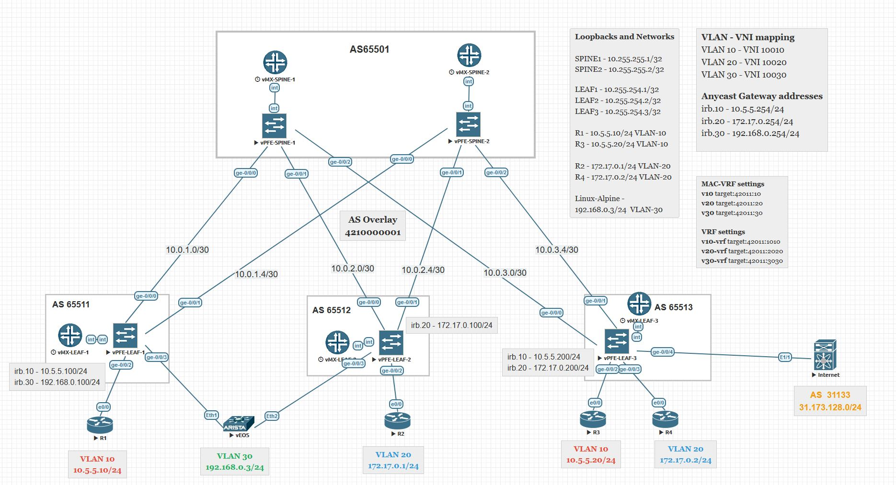

# Лабораторная работа по теме "Оптимизация таблиц маршрутизации"

### Цель:
- разобрать EVPN route-type 5 и его применение;
- настройка route-type для оптимизации маршрутизации.

### Топология



## Реализация

Цель EVPN Type-5 обеспечение связности между дата-центрами, подами.
Идея маршрута в том, что в отличии от Type-2 анонс Type-5 отделяется от MAC адреса 
и анонсируется только L3 префикс, который в дальнейшем можно использовать в обычном l3-vrf.

Пример конфигурации EVPN Type-5 для v10-vrf, v20-vrf, v30-vrf
```
set routing-instances v10-vrf protocols evpn ip-prefix-routes advertise direct-nexthop
set routing-instances v10-vrf protocols evpn ip-prefix-routes encapsulation vxlan
set routing-instances v10-vrf protocols evpn ip-prefix-routes vni 9910

set routing-instances v20-vrf protocols evpn ip-prefix-routes advertise direct-nexthop
set routing-instances v20-vrf protocols evpn ip-prefix-routes encapsulation vxlan
set routing-instances v20-vrf protocols evpn ip-prefix-routes vni 9920

set routing-instances v30-vrf protocols evpn ip-prefix-routes advertise direct-nexthop
set routing-instances v30-vrf protocols evpn ip-prefix-routes encapsulation vxlan
set routing-instances v30-vrf protocols evpn ip-prefix-routes vni 9930

```
Настройка внешнего стыка с AS31133

```
set routing-instances v10-vrf instance-type vrf
set routing-instances v10-vrf routing-options auto-export
set routing-instances v10-vrf protocols bgp group Internet type external
set routing-instances v10-vrf protocols bgp group Internet family inet unicast
set routing-instances v10-vrf protocols bgp group Internet export bgp-export
set routing-instances v10-vrf protocols bgp group Internet peer-as 31133
set routing-instances v10-vrf protocols bgp group Internet neighbor 185.180.22.2
set routing-instances v10-vrf interface ge-0/0/4.0
```
После поднятия BGP сессии у нас появляется анонс сети 31.173.128.0/24. 
Все наши сети как обычные l3 маршруты от vrf10/20/30-vrf были проанонсированы в организованный BGP стык (Internet)
это возможно благодаря type-5 маршрутам.
Если в vrf выключить создание type-5 маршрута, то он не будет импортировать внешние маршруты.

После добавления конфигурации выше, в сети появляются новые маршруты EVPN Type-5

```
2:10.255.254.1:1::0::2c:6b:f5:18:6f:f0::10.5.5.100/304 MAC/IP (1 entry, 0 announced)
        *EVPN   Preference: 170
                Next hop type: Indirect, Next hop index: 0
                Address: 0x89fc7ac
                Next-hop reference count: 33, key opaque handle: 0x0
                Protocol next hop: 10.255.254.1
                Indirect next hop: 0x0 - INH Session ID: 0
                State: <Secondary Active Int Ext>
                Age: 23:43
                Validation State: unverified
                Task: v10-evpn
                AS path: I
                Communities: target:42011:10 target:42011:1010 encapsulation:vxlan(0x8) evpn-default-gateway router-mac:2c:6b:f5:18:6f:f0
                Route Label: 10010
                Route Label: 9910
                ESI: 00:00:00:00:00:00:00:00:00:00
                Primary Routing Table: v10.evpn.0
                Thread: junos-main

5:10.255.254.1:100::0::10.5.5.0::24/248 (1 entry, 0 announced)
        *EVPN   Preference: 170
                Next hop type: Fictitious, Next hop index: 0
                Address: 0x89fc5fc
                Next-hop reference count: 12, key opaque handle: 0x0
                Next hop:
                State: <Secondary Active Int Ext>
                Age: 23:43
                Validation State: unverified
                Task: v10-vrf-EVPN-L3-context
                AS path: I
                Communities: target:42011:1010 encapsulation:vxlan(0x8) router-mac:2c:6b:f5:18:6f:f0
                Route Label: 9910
                Overlay gateway address: 0.0.0.0
                ESI 00:00:00:00:00:00:00:00:00:00
                Primary Routing Table: v10-vrf.evpn.0
                Thread: junos-main
```

Внешний маршрут на Leaf-3
```
root@leaf-3> show route 31.173.128.0/24 detail

v10-vrf.inet.0: 18 destinations, 34 routes (18 active, 0 holddown, 0 hidden)
31.173.128.0/24 (1 entry, 1 announced)
        *BGP    Preference: 170/-101
                Next hop type: Router, Next hop index: 657
                Address: 0x89fe090
                Next-hop reference count: 4, key opaque handle: 0x0
                Source: 185.180.22.2
                Next hop: 185.180.22.2 via ge-0/0/4.0, selected
                Session Id: 324
                State: <Active Ext>
                Peer AS: 31133
                Age: 43:36
                Validation State: unverified
                Task: BGP_31133.185.180.22.2
                Announcement bits (4): 0-Resolve tree 6 1-v10-vrf-EVPN-L3-context 2-KRT 3-rt-export
                AS path: 31133 I
                Accepted
                Localpref: 100
                Router ID: 3.3.3.3
                Thread: junos-main
```

Внешний маршрут на RR
```
root@spine-1> show route protocol bgp aspath-regex ^31133$ detail

bgp.evpn.0: 60 destinations, 60 routes (60 active, 0 holddown, 0 hidden)
5:10.255.254.3:100::0::31.173.128.0::24/248 (1 entry, 1 announced)
        *BGP    Preference: 170/-101
                Route Distinguisher: 10.255.254.3:100
                Next hop type: Indirect, Next hop index: 0
                Address: 0x89fce00
                Next-hop reference count: 24, key opaque handle: 0x0
                Source: 10.255.254.3
                Protocol next hop: 10.255.254.3
                Indirect next hop: 0x2 no-forward INH Session ID: 0
                State: <Active Int Ext>
                Local AS: 4210000001 Peer AS: 4210000001
                Age: 26:24      Metric2: 0
                Validation State: unverified
                Task: BGP_4210000001.10.255.254.3
                Announcement bits (1): 1-BGP_RT_Background
                AS path: 31133 I
                Communities: target:42011:1010 encapsulation:vxlan(0x8) router-mac:2c:6b:f5:9b:79:f0
                Accepted
                Route Label: 9910
                Overlay gateway address: 0.0.0.0
                ESI 00:00:00:00:00:00:00:00:00:00
                Localpref: 100
                Router ID: 10.255.254.3
                Thread: junos-main
```

Внешний маршрут на Leaf-1
```
root@leaf-1> show route table v10-vrf 31.173.128.0/24 detail

v10-vrf.inet.0: 17 destinations, 38 routes (17 active, 0 holddown, 0 hidden)
31.173.128.0/24 (2 entries, 1 announced)
        *EVPN   Preference: 170/-101
                Next hop type: Indirect, Next hop index: 0
                Address: 0x89fd37c
                Next-hop reference count: 18, key opaque handle: 0x0
                Next hop type: Router, Next hop index: 0
                Next hop: 10.0.1.2 via ge-0/0/0.0, selected
                Session Id: 0
                Next hop: 10.0.1.6 via ge-0/0/1.0
                Session Id: 0
                Protocol next hop: 10.255.254.3
                Indirect next hop: 0x71669ec 1048588 INH Session ID: 0
                State: <Active Int Ext>
                Age: 9:32       Metric2: 0
                Validation State: unverified
                Task: v10-vrf-EVPN-L3-context
                Announcement bits (3): 0-KRT 1-rt-export 2-Resolve tree 6
                AS path: 31133 I  (Originator)
                Cluster list:  10.255.250.1
                Originator ID: 10.255.254.3
                Thread: junos-main
         EVPN   Preference: 170/-101
                Next hop type: Indirect, Next hop index: 0
                Address: 0x89fd4c0
                Next-hop reference count: 12, key opaque handle: 0x0
                Next hop type: Router, Next hop index: 0
                Next hop: 10.0.1.2 via ge-0/0/0.0, selected
                Session Id: 0
                Next hop: 10.0.1.6 via ge-0/0/1.0
                Session Id: 0
                Protocol next hop: 10.255.254.3
                Indirect next hop: 0x7166eb4 1048590 INH Session ID: 0
                State: <Int Ext>
                Inactive reason: No difference
                Age: 9:32       Metric2: 0
                Validation State: unverified
                Task: v10-vrf-EVPN-L3-context
                AS path: 31133 I  (Originator)
                Cluster list:  10.255.250.1
                Originator ID: 10.255.254.3
                Thread: junos-main
```

Внешние маршруты на Internet
```
Internet# show bgp ipv4 unicast
BGP routing table information for VRF default, address family IPv4 Unicast
BGP table version is 24, Local Router ID is 3.3.3.3
Status: s-suppressed, x-deleted, S-stale, d-dampened, h-history, *-valid, >-best
Path type: i-internal, e-external, c-confed, l-local, a-aggregate, r-redist, I-i
njected
Origin codes: i - IGP, e - EGP, ? - incomplete, | - multipath, & - backup, 2 - b
est2

   Network            Next Hop            Metric     LocPrf     Weight Path
*>e10.5.5.0/24        185.180.22.1                                   0 421000000
1 i
*>e10.5.5.10/32       185.180.22.1                                   0 421000000
1 i
*>e10.5.5.20/32       185.180.22.1                                   0 421000000
1 i
*>e10.5.5.100/32      185.180.22.1                                   0 421000000
1 i
*>l31.173.128.0/24    0.0.0.0                           100      32768 i
*>e172.17.0.0/24      185.180.22.1                                   0 421000000
1 i
*>e172.17.0.1/32      185.180.22.1                                   0 421000000
1 i
*>e172.17.0.2/32      185.180.22.1                                   0 421000000
1 i
*>e172.17.0.100/32    185.180.22.1                                   0 421000000
1 i
*>e185.180.22.0/30    185.180.22.1                                   0 421000000
1 i
*>e192.168.0.0/24     185.180.22.1                                   0 421000000
1 i
*>e192.168.0.100/32   185.180.22.1                                   0 421000000
1 i
*>e192.168.0.200/32   185.180.22.1                                   0 421000000
1 i
```

## Связность

Доступность внешнего адреса с клиентских узлов.
```
R1#traceroute 31.173.128.1 numeric
Type escape sequence to abort.
Tracing the route to 31.173.128.1
VRF info: (vrf in name/id, vrf out name/id)
  1 10.5.5.100 4 msec 2 msec 8 msec
  2 10.5.5.200 7 msec 5 msec 5 msec
  3 31.173.128.1 10 msec 8 msec 6 msec
  
R1#ping 31.173.128.1
Type escape sequence to abort.
Sending 5, 100-byte ICMP Echos to 31.173.128.1, timeout is 2 seconds:
!!!!!
Success rate is 100 percent (5/5), round-trip min/avg/max = 7/8/10 ms
R1#
```

```
R2#traceroute 31.173.128.1 numeric
Type escape sequence to abort.
Tracing the route to 31.173.128.1
VRF info: (vrf in name/id, vrf out name/id)
  1 172.17.0.100 3 msec 1 msec 2 msec
  2 10.5.5.200 7 msec 3 msec 6 msec
  3 31.173.128.1 7 msec 14 msec 11 msec

R2#ping 31.173.128.1
Type escape sequence to abort.
Sending 5, 100-byte ICMP Echos to 31.173.128.1, timeout is 2 seconds:
!!!!!
Success rate is 100 percent (5/5), round-trip min/avg/max = 6/7/9 ms
```

```
R3#traceroute 31.173.128.1 numeric
Type escape sequence to abort.
Tracing the route to 31.173.128.1
VRF info: (vrf in name/id, vrf out name/id)
  1 10.5.5.200 2 msec 2 msec 2 msec
  2 31.173.128.1 5 msec 4 msec 4 msec

R3#ping 31.173.128.1
Type escape sequence to abort.
Sending 5, 100-byte ICMP Echos to 31.173.128.1, timeout is 2 seconds:
!!!!!
Success rate is 100 percent (5/5), round-trip min/avg/max = 3/3/5 ms
R3#

```

Useful links:
- [Understanding EVPN Pure Type 5 Routes](https://www.juniper.net/documentation/us/en/software/junos/evpn-vxlan/topics/concept/evpn-route-type5-understanding.html)
- [EVPN Type-5](https://www.juniper.net/documentation/us/en/software/junos/evpn-vxlan/topics/concept/evpn-vxlan-encapsulation.html)  
- [EVPN Type 2 and Type 5 Route Coexistence](https://www.juniper.net/documentation/us/en/software/junos/evpn-vxlan/topics/concept/evpn-t2-t5-coexist-evpn-vxlan.html)
- [EVPN Type 5 Routing over VXLAN Tunnels](https://www.juniper.net/documentation/us/en/software/cloud-native-router23.3/cloud-native-router-user/topics/concept/l3-evpn-type5-routing-over-vxlan-tunnels.html)
- [EVPN Type-5 MPLS](https://bgphelp.com/2017/04/23/evpn-type-5-configuration-example-juniper-mx/)  