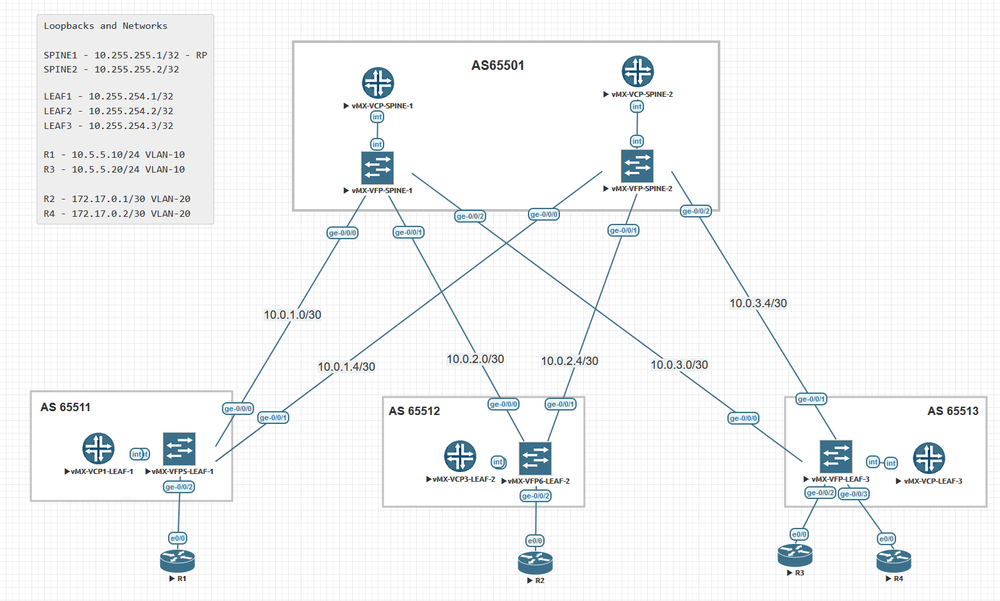

# Лабораторная работа по теме "VxLAN EVPN"

### Цель:
- Настроить Overlay на основе VxLAN EVPN для L2 связанности между клиентами

### Топология



## Реализация

Underlay маршрутизации на основе eBGP.
Overlay на основе iBGP все spine и leaf в одной AS 4210000001.
Все Spine свитчи являются RR с cluster-id 10.255.250.1 и между ними full-mesh.


Пример конфигурации для Leaf-1
```
set interfaces ge-0/0/2 vlan-tagging
set interfaces ge-0/0/2 encapsulation flexible-ethernet-services
set interfaces ge-0/0/2 unit 0 encapsulation vlan-bridge
set interfaces ge-0/0/2 unit 0 vlan-id 10

set routing-instances EVPN_10 vtep-source-interface lo0.0
set routing-instances EVPN_10 instance-type evpn
set routing-instances EVPN_10 vlan-id 10
set routing-instances EVPN_10 interface ge-0/0/2.0
set routing-instances EVPN_10 vxlan vni 10010
set routing-instances EVPN_10 route-distinguisher 10.255.254.1:1
set routing-instances EVPN_10 vrf-target target:1234:1
set routing-instances EVPN_10 protocols evpn encapsulation vxlan

set routing-options autonomous-system 4210000001

set protocols bgp group UNDERLAY type external
set protocols bgp group UNDERLAY advertise-peer-as
set protocols bgp group UNDERLAY family inet unicast
set protocols bgp group UNDERLAY export BGP_LOOPBACK0
set protocols bgp group UNDERLAY peer-as 65501
set protocols bgp group UNDERLAY local-as 65511
set protocols bgp group UNDERLAY multipath multiple-as
set protocols bgp group UNDERLAY as-override
set protocols bgp group UNDERLAY neighbor 10.0.1.2
set protocols bgp group UNDERLAY neighbor 10.0.1.6

set protocols bgp group OVERLAY type internal
set protocols bgp group OVERLAY local-address 10.255.254.1
set protocols bgp group OVERLAY family evpn signaling
set protocols bgp group OVERLAY neighbor 10.255.255.1
set protocols bgp group OVERLAY neighbor 10.255.255.2
```
`as-override` используется для анонса сети из AS65501 в AS 65501. 
С помощью этой команды origin AS заменяется на AS65511. т.о. пир принимает маршрут.
Это необходимо для установления соседства full-mesh между SPINE свитчами.


Конфигурация Spine-1
```
set routing-options autonomous-system 4210000001
set protocols bgp hold-time 10
set protocols bgp group UNDERLAY type external
set protocols bgp group UNDERLAY family inet unicast
set protocols bgp group UNDERLAY export BGP_LOOPBACK0
set protocols bgp group UNDERLAY local-as 65501
set protocols bgp group UNDERLAY multipath multiple-as
set protocols bgp group UNDERLAY neighbor 10.0.1.1 peer-as 65511
set protocols bgp group UNDERLAY neighbor 10.0.2.1 peer-as 65512
set protocols bgp group UNDERLAY neighbor 10.0.3.1 peer-as 65513

set protocols bgp group OVERLAY_RR_MESH type internal
set protocols bgp group OVERLAY_RR_MESH local-address 10.255.255.1
set protocols bgp group OVERLAY_RR_MESH family evpn signaling
set protocols bgp group OVERLAY_RR_MESH neighbor 10.255.255.2

set protocols bgp group OVERLAY type internal
set protocols bgp group OVERLAY local-address 10.255.255.1
set protocols bgp group OVERLAY family evpn signaling
set protocols bgp group OVERLAY cluster 10.255.250.1
set protocols bgp group OVERLAY multipath
set protocols bgp group OVERLAY neighbor 10.255.254.1
set protocols bgp group OVERLAY neighbor 10.255.254.2
set protocols bgp group OVERLAY neighbor 10.255.254.3
```

Пример вывода BGP соседств с leaf-3
```
root@leaf-3> show bgp summary
Threading mode: BGP I/O
Groups: 2 Peers: 4 Down peers: 0
Table          Tot Paths  Act Paths Suppressed    History Damp State    Pending
inet.0
                       8          6          0          0          0          0
bgp.evpn.0
                      12          6          0          0          0          0
Peer                     AS      InPkt     OutPkt    OutQ   Flaps Last Up/Dwn State|#Active/Received/Accepted/Damped...
10.0.3.2              65501        992        998       0       0       45:02 Establ
  inet.0: 3/4/4/0
10.0.3.6              65501        994        997       0       0       45:12 Establ
  inet.0: 3/4/4/0
10.255.255.1     4210000001       1337       1339       0       0     1:00:29 Establ
  EVPN_10.evpn.0: 3/3/3/0
  EVPN_20.evpn.0: 3/3/3/0
  __default_evpn__.evpn.0: 0/0/0/0
  bgp.evpn.0: 6/6/6/0
10.255.255.2     4210000001       1339       1342       0       0     1:00:39 Establ
  EVPN_10.evpn.0: 0/3/3/0
  EVPN_20.evpn.0: 0/3/3/0
  __default_evpn__.evpn.0: 0/0/0/0
  bgp.evpn.0: 0/6/6/0
```

Пример вывода BGP соседств со spine-1
```
root@spine-1> show bgp summary
Threading mode: BGP I/O
Groups: 3 Peers: 7 Down peers: 0
Table          Tot Paths  Act Paths Suppressed    History Damp State    Pending
inet.0
                      10          6          0          0          0          0
bgp.evpn.0
                      12         12          0          0          0          0
Peer                     AS      InPkt     OutPkt    OutQ   Flaps Last Up/Dwn State|#Active/Received/Accepted/Damped...
10.0.1.1              65511       1044       1035       0       2       46:57 Establ
  inet.0: 2/3/3/0
10.0.2.1              65512       1014       1012       0       1       45:51 Establ
  inet.0: 2/3/3/0
10.0.3.1              65513       1008       1001       0       1       45:28 Establ
  inet.0: 2/4/4/0
10.255.254.1     4210000001       1031       1025       0       2       46:30 Establ
  bgp.evpn.0: 3/3/3/0
10.255.254.2     4210000001       1354       1363       0       0     1:01:15 Establ
  bgp.evpn.0: 3/3/3/0
10.255.254.3     4210000001       1349       1345       0       0     1:00:55 Establ
  bgp.evpn.0: 6/6/6/0
10.255.255.2     4210000001        119        118       0       0       46:55 Establ
  bgp.evpn.0: 0/0/0/0
```

Анонсирование и получение MAC/IP с Spine-1 в сторону Leaf-1
```
root@spine-1> show route advertising-protocol bgp 10.255.254.1

bgp.evpn.0: 12 destinations, 12 routes (12 active, 0 holddown, 0 hidden)
  Prefix                  Nexthop              MED     Lclpref    AS path
  2:10.255.254.2:2::0::aa:bb:cc:00:04:00/304 MAC/IP
*                         10.255.254.2                 100        I
  2:10.255.254.3:1::0::aa:bb:cc:00:0c:00/304 MAC/IP
*                         10.255.254.3                 100        I
  2:10.255.254.3:2::0::aa:bb:cc:00:02:00/304 MAC/IP
*                         10.255.254.3                 100        I
  2:10.255.254.2:2::0::aa:bb:cc:00:04:00::172.17.0.1/304 MAC/IP
*                         10.255.254.2                 100        I
  2:10.255.254.3:1::0::aa:bb:cc:00:0c:00::10.5.5.20/304 MAC/IP
*                         10.255.254.3                 100        I
  2:10.255.254.3:2::0::aa:bb:cc:00:02:00::172.17.0.2/304 MAC/IP
*                         10.255.254.3                 100        I
  3:10.255.254.2:2::0::10.255.254.2/248 IM
*                         10.255.254.2                 100        I
  3:10.255.254.3:1::0::10.255.254.3/248 IM
*                         10.255.254.3                 100        I
  3:10.255.254.3:2::0::10.255.254.3/248 IM
*                         10.255.254.3                 100        I

root@spine-1> show route receive-protocol bgp 10.255.254.1

inet.0: 11 destinations, 17 routes (11 active, 0 holddown, 0 hidden)

inet6.0: 3 destinations, 3 routes (3 active, 0 holddown, 0 hidden)

bgp.evpn.0: 12 destinations, 12 routes (12 active, 0 holddown, 0 hidden)
  Prefix                  Nexthop              MED     Lclpref    AS path
  2:10.255.254.1:1::0::aa:bb:cc:00:0b:00/304 MAC/IP
*                         10.255.254.1                 100        I
  2:10.255.254.1:1::0::aa:bb:cc:00:0b:00::10.5.5.10/304 MAC/IP
*                         10.255.254.1                 100        I
  3:10.255.254.1:1::0::10.255.254.1/248 IM
*                         10.255.254.1                 100        I

root@spine-1>
```


### Доступность 

Доступность R1->R3
```
R1#show ip int br
Interface                  IP-Address      OK? Method Status                Protocol
Ethernet0/0                unassigned      YES unset  up                    up
Ethernet0/0.10             10.5.5.10       YES manual up                    up
Ethernet0/1                unassigned      YES unset  administratively down down
Ethernet0/2                unassigned      YES unset  administratively down down
Ethernet0/3                unassigned      YES unset  administratively down down
R1#ping 10.5.5.20
Type escape sequence to abort.
Sending 5, 100-byte ICMP Echos to 10.5.5.20, timeout is 2 seconds:
!!!!!
Success rate is 100 percent (5/5), round-trip min/avg/max = 4/5/8 ms
R1#

```
Доступность R3->R1
```
R3#show ip int br
Interface                  IP-Address      OK? Method Status                Protocol
Ethernet0/0                unassigned      YES unset  up                    up
Ethernet0/0.10             10.5.5.20       YES manual up                    up
Ethernet0/1                unassigned      YES unset  administratively down down
Ethernet0/2                unassigned      YES unset  administratively down down
Ethernet0/3                unassigned      YES unset  administratively down down
R3#ping 10.5.5.10
Type escape sequence to abort.
Sending 5, 100-byte ICMP Echos to 10.5.5.10, timeout is 2 seconds:
!!!!!
Success rate is 100 percent (5/5), round-trip min/avg/max = 4/5/7 ms
R3#
```

Доступность R2->R4
```
R2#show ip int br
Interface                  IP-Address      OK? Method Status                Protocol
Ethernet0/0                unassigned      YES unset  up                    up
Ethernet0/0.20             172.17.0.1      YES manual up                    up
Ethernet0/1                unassigned      YES unset  administratively down down
Ethernet0/2                unassigned      YES unset  administratively down down
Ethernet0/3                unassigned      YES unset  administratively down down
R2#ping 172.17.0.2
Type escape sequence to abort.
Sending 5, 100-byte ICMP Echos to 172.17.0.2, timeout is 2 seconds:
.!!!!
Success rate is 80 percent (4/5), round-trip min/avg/max = 4/5/10 ms
```

Доступность R4->R2
```
R4#show ip int br
Interface                  IP-Address      OK? Method Status                Protocol
Ethernet0/0                unassigned      YES unset  up                    up
Ethernet0/0.20             172.17.0.2      YES manual up                    up
Ethernet0/1                unassigned      YES unset  administratively down down
Ethernet0/2                unassigned      YES unset  administratively down down
Ethernet0/3                unassigned      YES unset  administratively down down
R4#ping 172.17.0.1
Type escape sequence to abort.
Sending 5, 100-byte ICMP Echos to 172.17.0.1, timeout is 2 seconds:
!!!!!
Success rate is 100 percent (5/5), round-trip min/avg/max = 5/6/8 ms
R4#
```


### Дополнительные выводы с leaf-3


```
root@leaf-3> show evpn database
Instance: EVPN_10
VLAN  DomainId  MAC address        Active source                  Timestamp        IP address
     10010      aa:bb:cc:00:0b:00  10.255.254.1                   Oct 10 14:20:41  10.5.5.10
     10010      aa:bb:cc:00:0c:00  ge-0/0/2.0                     Oct 10 14:20:40  10.5.5.20

Instance: EVPN_20
VLAN  DomainId  MAC address        Active source                  Timestamp        IP address
     10020      aa:bb:cc:00:02:00  ge-0/0/3.0                     Oct 10 14:20:44  172.17.0.2
     10020      aa:bb:cc:00:04:00  10.255.254.2                   Oct 10 14:04:22  172.17.0.1

root@leaf-3>
```

Подробный вывод для EVPN_10.
```
root@leaf-3> show evpn instance EVPN_10 extensive
Instance: EVPN_10
  Route Distinguisher: 10.255.254.3:1
  VLAN ID: 10
  Encapsulation type: VXLAN
  Duplicate MAC detection threshold: 5
  Duplicate MAC detection window: 180
  MAC database status                     Local  Remote
    MAC advertisements:                       1       1
    MAC+IP advertisements:                    1       1
    Default gateway MAC advertisements:       0       0
  Number of local interfaces: 2 (2 up)
    Interface name  ESI                            Mode             Status     AC-Role
    .local..8       00:00:00:00:00:00:00:00:00:00  single-homed     Up         Root
    ge-0/0/2.0      00:00:00:00:00:00:00:00:00:00  single-homed     Up         Root
  Number of IRB interfaces: 0 (0 up)
  Number of protect interfaces: 0
  Number of bridge domains: 1
    VLAN  Domain ID   Intfs / up    IRB intf   Mode      MAC sync  IM route label  IPv4 SG sync  IPv4 IM core nexthop  IPv6 SG sync  IPv6 IM core nexthop
    10    10010          1    1                Extended         Enabled   10010           Disabled                    Disabled
  Number of neighbors: 1
    Address               MAC    MAC+IP        AD        IM        ES Leaf-label
    10.255.254.1            1         1         0         1         0
  Number of ethernet segments: 0
  Router-ID: 10.255.254.3
  Source VTEP interface IP: 10.255.254.3
  SMET Forwarding: Disabled
```

```
root@leaf-3> show route 
<...omit...>
EVPN_10.evpn.0: 6 destinations, 9 routes (6 active, 0 holddown, 0 hidden)
+ = Active Route, - = Last Active, * = Both

2:10.255.254.1:1::0::aa:bb:cc:00:0b:00/304 MAC/IP
                   *[BGP/170] 00:05:47, localpref 100, from 10.255.255.1
                      AS path: I, validation-state: unverified
                       to 10.0.3.2 via ge-0/0/0.0
                    >  to 10.0.3.6 via ge-0/0/1.0
                    [BGP/170] 00:05:47, localpref 100, from 10.255.255.2
                      AS path: I, validation-state: unverified
                       to 10.0.3.2 via ge-0/0/0.0
                    >  to 10.0.3.6 via ge-0/0/1.0
2:10.255.254.3:1::0::aa:bb:cc:00:0c:00/304 MAC/IP
                   *[EVPN/170] 00:00:48
                       Indirect
2:10.255.254.1:1::0::aa:bb:cc:00:0b:00::10.5.5.10/304 MAC/IP
                   *[BGP/170] 00:05:47, localpref 100, from 10.255.255.1
                      AS path: I, validation-state: unverified
                    >  to 10.0.3.2 via ge-0/0/0.0
                       to 10.0.3.6 via ge-0/0/1.0
                    [BGP/170] 00:05:47, localpref 100, from 10.255.255.2
                      AS path: I, validation-state: unverified
                    >  to 10.0.3.2 via ge-0/0/0.0
                       to 10.0.3.6 via ge-0/0/1.0
2:10.255.254.3:1::0::aa:bb:cc:00:0c:00::10.5.5.20/304 MAC/IP
                   *[EVPN/170] 00:00:48
                       Indirect
3:10.255.254.1:1::0::10.255.254.1/248 IM
                   *[BGP/170] 00:33:26, localpref 100, from 10.255.255.1
                      AS path: I, validation-state: unverified
                    >  to 10.0.3.2 via ge-0/0/0.0
                       to 10.0.3.6 via ge-0/0/1.0
                    [BGP/170] 00:33:25, localpref 100, from 10.255.255.2
                      AS path: I, validation-state: unverified
                    >  to 10.0.3.2 via ge-0/0/0.0
                       to 10.0.3.6 via ge-0/0/1.0
3:10.255.254.3:1::0::10.255.254.3/248 IM
                   *[EVPN/170] 00:33:24
                       Indirect

EVPN_20.evpn.0: 6 destinations, 9 routes (6 active, 0 holddown, 0 hidden)
+ = Active Route, - = Last Active, * = Both

2:10.255.254.2:2::0::aa:bb:cc:00:04:00/304 MAC/IP
                   *[BGP/170] 00:22:06, localpref 100, from 10.255.255.1
                      AS path: I, validation-state: unverified
                    >  to 10.0.3.2 via ge-0/0/0.0
                       to 10.0.3.6 via ge-0/0/1.0
                    [BGP/170] 00:22:06, localpref 100, from 10.255.255.2
                      AS path: I, validation-state: unverified
                    >  to 10.0.3.2 via ge-0/0/0.0
                       to 10.0.3.6 via ge-0/0/1.0
2:10.255.254.3:2::0::aa:bb:cc:00:02:00/304 MAC/IP
                   *[EVPN/170] 00:00:44
                       Indirect
2:10.255.254.2:2::0::aa:bb:cc:00:04:00::172.17.0.1/304 MAC/IP
                   *[BGP/170] 00:22:06, localpref 100, from 10.255.255.1
                      AS path: I, validation-state: unverified
                    >  to 10.0.3.2 via ge-0/0/0.0
                       to 10.0.3.6 via ge-0/0/1.0
                    [BGP/170] 00:22:06, localpref 100, from 10.255.255.2
                      AS path: I, validation-state: unverified
                    >  to 10.0.3.2 via ge-0/0/0.0
                       to 10.0.3.6 via ge-0/0/1.0
2:10.255.254.3:2::0::aa:bb:cc:00:02:00::172.17.0.2/304 MAC/IP
                   *[EVPN/170] 00:00:44
                       Indirect
3:10.255.254.2:2::0::10.255.254.2/248 IM
                   *[BGP/170] 00:22:19, localpref 100, from 10.255.255.1
                      AS path: I, validation-state: unverified
                    >  to 10.0.3.2 via ge-0/0/0.0
                       to 10.0.3.6 via ge-0/0/1.0
                    [BGP/170] 00:22:19, localpref 100, from 10.255.255.2
                      AS path: I, validation-state: unverified
                    >  to 10.0.3.2 via ge-0/0/0.0
                       to 10.0.3.6 via ge-0/0/1.0
3:10.255.254.3:2::0::10.255.254.3/248 IM
                   *[EVPN/170] 00:33:24
                       Indirect

root@leaf-3>

```

Детальное описание маршрута.
т.е.VxLAN туннель от leaf-3 (10.255.254.3) будет построен до leaf-1(10.255.254.1)

```
root@leaf-3> show route evpn-mac-address aa:bb:cc:00:0b:00 table EVPN_10 detail

EVPN_10.evpn.0: 6 destinations, 9 routes (6 active, 0 holddown, 0 hidden)
2:10.255.254.1:1::0::aa:bb:cc:00:0b:00/304 MAC/IP (2 entries, 1 announced)
        *BGP    Preference: 170/-101
                Route Distinguisher: 10.255.254.1:1
                Next hop type: Indirect, Next hop index: 0
                Address: 0xce32a70
                Next-hop reference count: 12
                Source: 10.255.255.1
                Protocol next hop: 10.255.254.1
                Indirect next hop: 0x2 no-forward INH Session ID: 0x0
                State: <Secondary Active Int Ext>
                Local AS: 4210000001 Peer AS: 4210000001
                Age: 7:28       Metric2: 0
                Validation State: unverified
                Task: BGP_4210000001.10.255.255.1
                Announcement bits (1): 0-EVPN_10-evpn
                AS path: I  (Originator)
                Cluster list:  10.255.250.1
                Originator ID: 10.255.254.1
                Communities: target:1234:1 encapsulation:vxlan(0x8)
                Import Accepted
                Route Label: 10010
                ESI: 00:00:00:00:00:00:00:00:00:00
                Localpref: 100
                Router ID: 10.255.255.1
                Primary Routing Table bgp.evpn.0
         BGP    Preference: 170/-101
                Route Distinguisher: 10.255.254.1:1
                Next hop type: Indirect, Next hop index: 0
                Address: 0xce32a70
                Next-hop reference count: 12
                Source: 10.255.255.2
                Protocol next hop: 10.255.254.1
                Indirect next hop: 0x2 no-forward INH Session ID: 0x0
                State: <Secondary NotBest Int Ext Changed>
                Inactive reason: Not Best in its group - Update source
                Local AS: 4210000001 Peer AS: 4210000001
                Age: 7:28       Metric2: 0
                Validation State: unverified
                Task: BGP_4210000001.10.255.255.2
                AS path: I  (Originator)
                Cluster list:  10.255.250.1
                Originator ID: 10.255.254.1
                Communities: target:1234:1 encapsulation:vxlan(0x8)
                Import Accepted
                Route Label: 10010
                ESI: 00:00:00:00:00:00:00:00:00:00
                Localpref: 100
                Router ID: 10.255.255.2
                Primary Routing Table bgp.evpn.0

2:10.255.254.1:1::0::aa:bb:cc:00:0b:00::10.5.5.10/304 MAC/IP (2 entries, 1 announced)
        *BGP    Preference: 170/-101
                Route Distinguisher: 10.255.254.1:1
                Next hop type: Indirect, Next hop index: 0
                Address: 0xce32a70
                Next-hop reference count: 12
                Source: 10.255.255.1
                Protocol next hop: 10.255.254.1
                Indirect next hop: 0x2 no-forward INH Session ID: 0x0
                State: <Secondary Active Int Ext>
                Local AS: 4210000001 Peer AS: 4210000001
                Age: 7:28       Metric2: 0
                Validation State: unverified
                Task: BGP_4210000001.10.255.255.1
                Announcement bits (1): 0-EVPN_10-evpn
                AS path: I  (Originator)
                Cluster list:  10.255.250.1
                Originator ID: 10.255.254.1
                Communities: target:1234:1 encapsulation:vxlan(0x8)
                Import Accepted
                Route Label: 10010
                ESI: 00:00:00:00:00:00:00:00:00:00
                Localpref: 100
                Router ID: 10.255.255.1
                Primary Routing Table bgp.evpn.0
         BGP    Preference: 170/-101
                Route Distinguisher: 10.255.254.1:1
                Next hop type: Indirect, Next hop index: 0
                Address: 0xce32a70
                Next-hop reference count: 12
                Source: 10.255.255.2
                Protocol next hop: 10.255.254.1
                Indirect next hop: 0x2 no-forward INH Session ID: 0x0
                State: <Secondary NotBest Int Ext Changed>
                Inactive reason: Not Best in its group - Update source
                Local AS: 4210000001 Peer AS: 4210000001
                Age: 7:28       Metric2: 0
                Validation State: unverified
                Task: BGP_4210000001.10.255.255.2
                AS path: I  (Originator)
                Cluster list:  10.255.250.1
                Originator ID: 10.255.254.1
                Communities: target:1234:1 encapsulation:vxlan(0x8)
                Import Accepted
                Route Label: 10010
                ESI: 00:00:00:00:00:00:00:00:00:00
                Localpref: 100
                Router ID: 10.255.255.2
                Primary Routing Table bgp.evpn.0

```