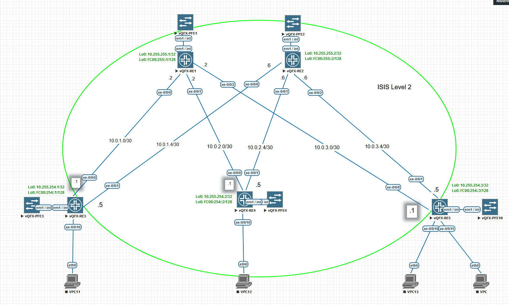

# Лабораторная работа по теме "Построение Underlay сети(ISIS)"

### Цель:
- исследовать построение Underlay сети с использованием ISIS

### Топология



## Реализация

В конфигурацию устройств был добавлен ISIS протокол.
Интерфейсы все в `point-to-point`.
Лупбек адреса добавлены как `passive`.
Level-2 для всех интерфейсов

Network entity получен из лупбек адреса.

Пример конфигурации ISIS для Leaf-1
```
set interface xe-0/0/0 unit 0 family iso
set interface xe-0/0/1 unit 0 family iso
set interface lo0 unit 0 family iso address 49.0007.0102.5525.4001.00
set protocols isis interface xe-0/0/0.0 point-to-point
set protocols isis interface xe-0/0/0.0 level 1 disable
set protocols isis interface xe-0/0/1.0 point-to-point
set protocols isis interface xe-0/0/1.0 level 1 disable
set protocols isis interface lo0.0 passive
set protocols isis interface lo0.0 level 1 disable
set protocols isis level 2 wide-metrics-only
set policy-options policy-statement ecmp term 1 then load-balance per-packet
set routing-options forwarding-table export ecmp
```

Пример конфигурации ISIS для Spine-1
```
delete protocol
set interface xe-0/0/0 unit 0 family iso
set interface xe-0/0/1 unit 0 family iso
set interface xe-0/0/2 unit 0 family iso
set interface lo0 unit 0 family iso address 49.0007.0102.5525.5001.00
set protocols isis interface xe-0/0/0.0 point-to-point
set protocols isis interface xe-0/0/0.0 level 1 disable
set protocols isis interface xe-0/0/1.0 point-to-point
set protocols isis interface xe-0/0/1.0 level 1 disable
set protocols isis interface xe-0/0/2.0 point-to-point
set protocols isis interface xe-0/0/2.0 level 1 disable
set protocols isis interface lo0.0 passive
set protocols isis interface lo0.0 level 1 disable
set protocols isis level 2 wide-metrics-only
set policy-options policy-statement ecmp term 1 then load-balance per-packet
set routing-options forwarding-table export ecmp
```

Пример вывода соседства с Leaf-3
```
root@leaf-3> show isis adjacency
Interface             System         L State        Hold (secs) SNPA
xe-0/0/0.0            spine-1        2  Up                   26
xe-0/0/1.0            spine-2        2  Up                   25
```

Пример вывода соседства с spine-1
```
root@spine-1> show isis adjacency
Interface             System         L State        Hold (secs) SNPA
xe-0/0/0.0            leaf-1         2  Up                   25
xe-0/0/1.0            leaf-2         2  Up                   13
xe-0/0/2.0            leaf-3         2  Up                   24
```

Таблица маршрутизации протокола ISIS
```
root@leaf-3> show route protocol isis

inet.0: 15 destinations, 15 routes (15 active, 0 holddown, 0 hidden)
+ = Active Route, - = Last Active, * = Both

10.0.1.0/30        *[IS-IS/15] 00:03:41, metric 20
                    > to 10.0.3.2 via xe-0/0/0.0
10.0.1.4/30        *[IS-IS/15] 00:03:12, metric 20
                    > to 10.0.3.6 via xe-0/0/1.0
10.0.2.0/30        *[IS-IS/15] 00:03:42, metric 20
                    > to 10.0.3.2 via xe-0/0/0.0
10.0.2.4/30        *[IS-IS/15] 00:03:12, metric 20
                    > to 10.0.3.6 via xe-0/0/1.0
10.255.254.1/32    *[IS-IS/15] 00:03:12, metric 20
                      to 10.0.3.2 via xe-0/0/0.0
                    > to 10.0.3.6 via xe-0/0/1.0
10.255.254.2/32    *[IS-IS/15] 00:03:12, metric 20
                      to 10.0.3.2 via xe-0/0/0.0
                    > to 10.0.3.6 via xe-0/0/1.0
10.255.255.1/32    *[IS-IS/15] 00:03:42, metric 10
                    > to 10.0.3.2 via xe-0/0/0.0
10.255.255.2/32    *[IS-IS/15] 00:03:12, metric 10
                    > to 10.0.3.6 via xe-0/0/1.0

root@leaf-3> show route 10.255.254.2 detail

inet.0: 15 destinations, 15 routes (15 active, 0 holddown, 0 hidden)
10.255.254.2/32 (1 entry, 1 announced)
        *IS-IS  Preference: 18
                Level: 2
                Next hop type: Router, Next hop index: 0
                Address: 0xb219190
                Next-hop reference count: 2
                Next hop: 10.0.3.2 via xe-0/0/0.0
                Session Id: 0x0
                Next hop: 10.0.3.6 via xe-0/0/1.0, selected
                Session Id: 0x0
                State: <Active Int>
                Age: 6:30       Metric: 20
                Validation State: unverified
                ORR Generation-ID: 0
                Task: IS-IS
                Announcement bits (1): 0-KRT
                AS path: I

root@leaf-3> show isis adjacency spine-1 detail
spine-1
  Interface: xe-0/0/0.0, Level: 2, State: Up, Expires in 20 secs
  Priority: 0, Up/Down transitions: 3, Last transition: 00:08:07 ago
  Circuit type: 2, Speaks: IP, IPv6
  Topologies: Unicast
  Restart capable: Yes, Adjacency advertisement: Advertise
  IP addresses: 10.0.3.2

```