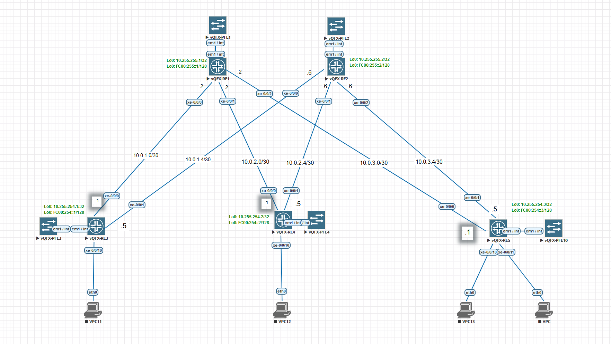

# Лабораторная работа по теме "Проектирование адресного пространства"

### Цель:
- Собрать схему CLOS;
- Распределить адресное пространство;

### Топология

### Задачи
- Собрать топологию CLOS, как на схеме выше
- Распределить адресное пространство для Underlay сети
- План работы, адресное пространство, схема сети, настройки - зафиксированы в документации

## Реализация

На топологии приведены адреса для Leaf, Spine узлов и линков между ними.

Распределение адресов для Loopback интерфейсов
| Device Type | IP Range | 
|:-------------|:----------|
| Leaf | 10.255.254.0/24, FC00:254::0/120|
| Spine | 10.255.255.0/24, FC00:255::0/120|

Распределение адресов для p2p интерфейсов
Leaf-N <-> Spine | 10.0.n.l/30.
Где:
N - номер leaf свитча, 
L - номер линка, считатся от номера сети. 0, 4, 8, и т.д.

На Leaf младший адрес
На Spine старший адрес
