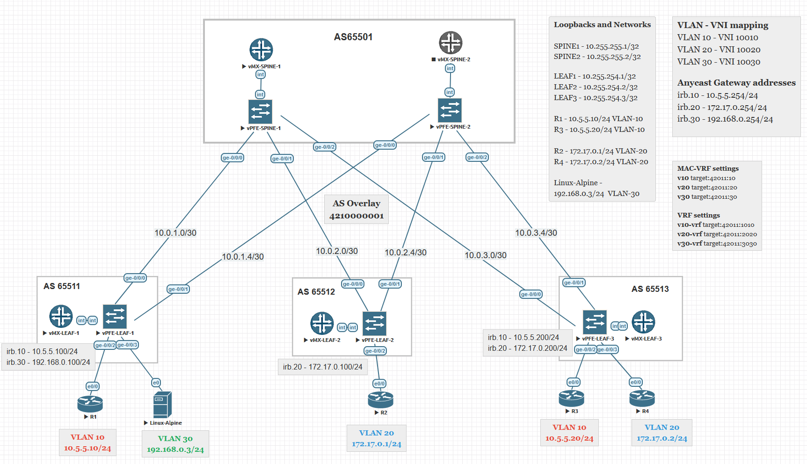
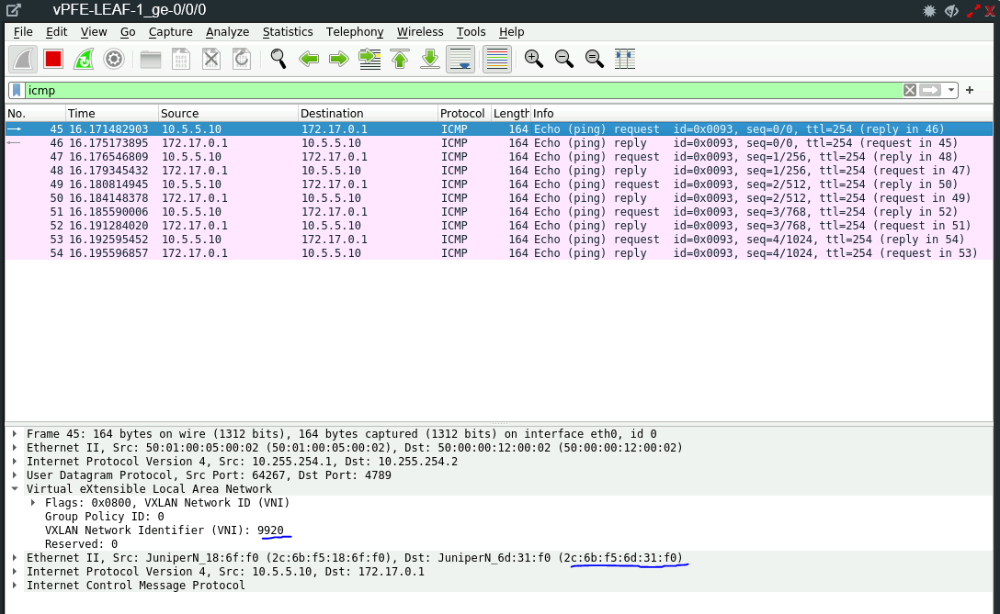
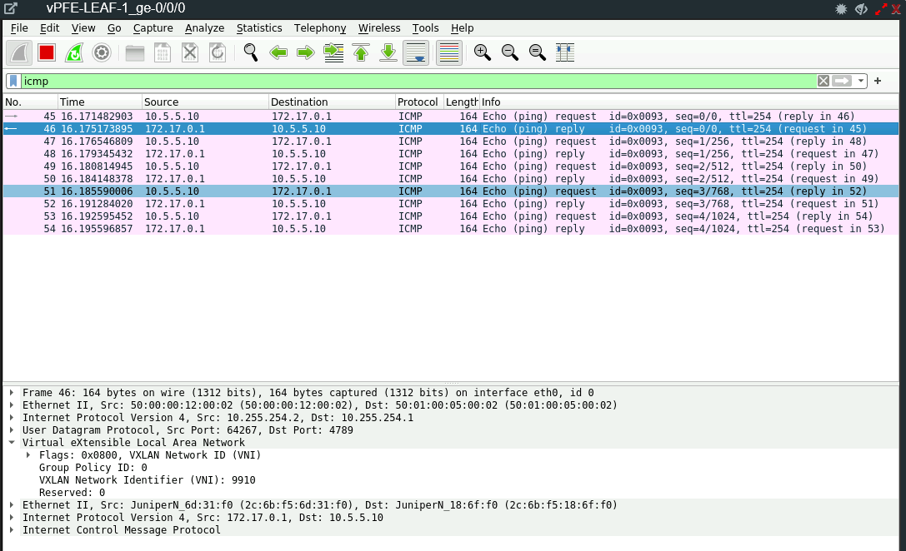

# Лабораторная работа по теме "VxLAN EVPN L3"

### Цель:
- Рассмотреть возможности маршрутизации с использованием EVPN между различными VNI.


### Топология



## Реализация

Underlay маршрутизации на основе eBGP.  
Overlay на основе iBGP все spine и leaf в одной AS 4210000001.  
Конфигурация spine не меняется, добавляется только конфигурация для `mac-vrf` и `vrf`.  
  
Создаем на каждый vlan свой собственный mac-vrf, в моей конфигурации это `v10`, `v20`, `v30`.  
В них объявляем тип сервиса это vlan-based, vlan-bundle, vlan-aware.  
[Отличие vlan-based, vlan-bundle, vlan-aware](https://www.juniper.net/documentation/us/en/software/junos/evpn-vxlan/topics/concept/mac-vrf-routing-instance-overview.html)  
В моем случае это будет vlan-based, поскольку только один bridge-domain и один vlan нам нужен.
Описываем bridge-domain и объявляем клиентский интерфейс включая irb (это обязательно), vlan-id и vni.  
Далее идут RD, RT, VTEP.  

Пример конфигурации для Leaf-1
```
root@leaf-1> show configuration routing-instances
v10 {                                             
    instance-type mac-vrf;                        
    protocols {                                   
        evpn {                                    
            encapsulation vxlan;                  
            extended-vni-list 10010;              
        }                                         
    }                                             
    vtep-source-interface lo0.0;                  
    bridge-domains {                              
        v10 {                                     
            vlan-id 10;                           
            interface ge-0/0/2.10;                
            routing-interface irb.10;             
            vxlan {                               
                vni 10010;                        
            }                                     
        }                                         
    }                                             
    service-type vlan-based;                      
    route-distinguisher 10.255.254.1:1;           
    vrf-import mac10-import;                      
    vrf-target target:42011:10;                   
}
```
Затем `mac-vrf` надо объединить с соответствующим ему `L3 VRF`.  
Самое главное в него нужно добавить тот же `irb` интерфейс что использовался в mac-vrf выше.  
_По командам:_  
- `auto-export` - позволяет выполнить экспорт маршрутов в другой VRF. Работает только между локальными VRF. т.е. внутри одного роутера.  
Если эту команду не добавлять, то `v10-vrf` не будет иметь маршрутов до `v30-vrf` и наоборот.  
[JunOS auto-export](https://www.juniper.net/documentation/us/en/software/junos/static-routing/topics/ref/statement/auto-export-edit-routing-options.html#id-10667172__d17790e118)  
- `irb-symmetric-routing` - указывает VNI для L3.  
[JunOS irb-symmetric-routing](https://www.juniper.net/documentation/us/en/software/junos/evpn-vxlan/topics/ref/statement/irb-symmetric-routing-protocols-evpn.html#xd_f274c31ef906a296--74777d74-17dc232e598--7d62__section_qjx_p3d_hlb)  

```                                                 
v10-vrf {                                         
    instance-type vrf;                            
    routing-options {                             
        auto-export;                              
    }                                             
    protocols {                                   
        evpn {                                    
            irb-symmetric-routing {               
                vni 9910;                         
            }                                     
        }                                         
    }                                             
    interface irb.10;                             
    route-distinguisher 10.255.254.1:100;         
    vrf-import vrf10-import;                      
    vrf-target target:42011:1010;                 
    vrf-table-label;                              
}
```
Далее аналогичным образом настраиваем `v30`, `v30-vrf`.  
Полная конфигурая для `vlan 30`  
```
v30 {                                             
    instance-type mac-vrf;                        
    protocols {                                   
        evpn {                                    
            encapsulation vxlan;                  
            extended-vni-list 10030;              
        }                                         
    }                                             
    vtep-source-interface lo0.0;                  
    bridge-domains {                              
        v30 {                                     
            vlan-id 30;                           
            interface ge-0/0/3.30;                
            routing-interface irb.30;             
            vxlan {                               
                vni 10030;                        
            }                                     
        }                                         
    }                                             
    service-type vlan-based;                      
    route-distinguisher 10.255.254.1:3;           
    vrf-import mac30-import;                      
    vrf-target target:42011:30;                   
}
v30-vrf {                                 
    instance-type vrf;                    
    routing-options {                     
        auto-export;                      
    }                                     
    protocols {                           
        evpn {                            
            irb-symmetric-routing {       
                vni 9930;                 
            }                             
        }                                 
    }                                     
    interface irb.30;                     
    route-distinguisher 10.255.254.1:300; 
    vrf-import vrf30-import;              
    vrf-target target:42011:3030;         
    vrf-table-label;                      
}
```

Конфигурация интерфейсов `IRB` и `ge-*`
```
root@leaf-1> show configuration interfaces irb    
unit 10 {                                         
    virtual-gateway-accept-data;                  
    family inet {                                 
        address 10.5.5.100/24 {                   
            virtual-gateway-address 10.5.5.254;   
        }                                         
    }                                             
}                                                 
unit 30 {                                         
    virtual-gateway-accept-data;                  
    family inet {                                 
        address 192.168.0.100/24 {                
            virtual-gateway-address 192.168.0.254;
        }                                         
    }                                             
}         

root@leaf-1> show configuration interfaces ge-0/0/2 
flexible-vlan-tagging;                              
encapsulation extended-vlan-bridge;                 
unit 10 {                                           
    vlan-id 10;                                     
}                                                   
                                                    
root@leaf-1> show configuration interfaces ge-0/0/3 
flexible-vlan-tagging;                              
encapsulation extended-vlan-bridge;                 
unit 30 {                                           
    vlan-id 30;                                     
}                                                   
```
Команда `virtual-gateway-accept-data` позволяет быть доступным `virtual-gateway-address`, к примеру для пингов.  
Все клиентские устройства настраиваются с default gateway адресом указанном в команде `virtual-gateway-address`  

Настройка фильтров для ликинга маршрутов между vrfs.  
Нужно сделать фильтры для mac-vrf и vrf.  
С помощью этих фильтров мы в импортируемом vrf получим маршруты/MAC Type-2 других vrf'ов, к примеру v20-vrf, v30-vrf, 
которые были объявлены на другие leaf свитчах.  
```
root@leaf-1> show configuration policy-options 
policy-statement mac10-import {                 
    term local-orig {                           
        from community v10;                     
        then accept;                            
    }                                           
    term v20-orig {                             
        from community v20;                     
        then accept;                            
    }                                           
    term v30-orig {                             
        from community v30;                     
        then accept;                            
    }                                           
}                                               
policy-statement mac30-import {                 
    term local-orig {                           
        from community v30;                     
        then accept;                            
    }                                           
    term v10-orig {                             
        from community v10;                     
        then accept;                            
    }                                           
    term v20-orig {                             
        from community v20;                     
        then accept;                            
    }                                           
}                                                                                          
policy-statement vrf10-import {                 
    from community [ v10-vrf v20-vrf v30-vrf ]; 
    then accept;                                
}                                               
policy-statement vrf30-import {                 
    from community [ v10-vrf v20-vrf v30-vrf ]; 
    then accept;                                
}                                               
community v10 members target:42011:10;          
community v10-vrf members target:42011:1010;    
community v20 members target:42011:20;          
community v20-vrf members target:42011:2020;    
community v30 members target:42011:30;          
community v30-vrf members target:42011:3030;    
```
Если нужно ограничить доступность между vlan-30 и vlan-20, то для этого нужно изменить фильтры в конфигурации vrf-import соответствующих routing-instance.

## Доступность всех клиентских устройств между собой.

Доступность с R1 из VLAN-10
```
R1#show ip int br
Interface                  IP-Address      OK? Method Status                Protocol
Ethernet0/0                unassigned      YES NVRAM  up                    up
Ethernet0/0.10             10.5.5.10       YES NVRAM  up                    up
R1#show arp
Protocol  Address          Age (min)  Hardware Addr   Type   Interface
Internet  10.5.5.10               -   aabb.cc00.0b00  ARPA   Ethernet0/0.10
Internet  10.5.5.20             178   aabb.cc00.0c00  ARPA   Ethernet0/0.10
Internet  10.5.5.100              2   2c6b.f518.6ff0  ARPA   Ethernet0/0.10
Internet  10.5.5.101             93   2c6b.f529.dbf0  ARPA   Ethernet0/0.10
Internet  10.5.5.200             51   2c6b.f529.dbf0  ARPA   Ethernet0/0.10
Internet  10.5.5.254             61   0000.5e00.0101  ARPA   Ethernet0/0.10
R1#ping 10.5.5.20
Type escape sequence to abort.
Sending 5, 100-byte ICMP Echos to 10.5.5.20, timeout is 2 seconds:
!!!!!
Success rate is 100 percent (5/5), round-trip min/avg/max = 3/3/4 ms
R1#ping 172.17.0.1
Type escape sequence to abort.
Sending 5, 100-byte ICMP Echos to 172.17.0.1, timeout is 2 seconds:
!!!!!
Success rate is 100 percent (5/5), round-trip min/avg/max = 4/4/5 ms
R1#ping 172.17.0.2
Type escape sequence to abort.
Sending 5, 100-byte ICMP Echos to 172.17.0.2, timeout is 2 seconds:
!!!!!
Success rate is 100 percent (5/5), round-trip min/avg/max = 3/4/6 ms
R1#ping 192.168.0.3
Type escape sequence to abort.
Sending 5, 100-byte ICMP Echos to 192.168.0.3, timeout is 2 seconds:
!!!!!
Success rate is 100 percent (5/5), round-trip min/avg/max = 1/2/3 ms
R1#
```

Доступность c Linux-Alpine из VLAN-30
```
alpine:~# ping 10.5.5.10
PING 10.5.5.10 (10.5.5.10): 56 data bytes
64 bytes from 10.5.5.10: seq=0 ttl=254 time=2.382 ms
64 bytes from 10.5.5.10: seq=1 ttl=254 time=3.062 ms
^C
--- 10.5.5.10 ping statistics ---
2 packets transmitted, 2 packets received, 0% packet loss
round-trip min/avg/max = 2.382/2.722/3.062 ms
alpine:~# ping 10.5.5.20 -c 2
PING 10.5.5.20 (10.5.5.20): 56 data bytes
64 bytes from 10.5.5.20: seq=0 ttl=253 time=5.406 ms
64 bytes from 10.5.5.20: seq=1 ttl=253 time=5.594 ms

--- 10.5.5.20 ping statistics ---
2 packets transmitted, 2 packets received, 0% packet loss
round-trip min/avg/max = 5.406/5.500/5.594 ms
alpine:~# ping 172.17.0.1 -c 2
PING 172.17.0.1 (172.17.0.1): 56 data bytes
64 bytes from 172.17.0.1: seq=0 ttl=253 time=7.697 ms
64 bytes from 172.17.0.1: seq=1 ttl=253 time=7.434 ms

--- 172.17.0.1 ping statistics ---
2 packets transmitted, 2 packets received, 0% packet loss
round-trip min/avg/max = 7.434/7.565/7.697 ms
alpine:~# ping 172.17.0.2 -c 2
PING 172.17.0.2 (172.17.0.2): 56 data bytes
64 bytes from 172.17.0.2: seq=0 ttl=253 time=6.030 ms
64 bytes from 172.17.0.2: seq=1 ttl=253 time=7.732 ms

--- 172.17.0.2 ping statistics ---
2 packets transmitted, 2 packets received, 0% packet loss
round-trip min/avg/max = 6.030/6.881/7.732 ms
alpine:~#
```

Доступность с R2 из VLAN-20
```
R2#show ip int br
Interface                  IP-Address      OK? Method Status                Protocol
Ethernet0/0                unassigned      YES NVRAM  up                    up
Ethernet0/0.20             172.17.0.1      YES manual up                    up
R2#ping 172.17.0.2
Type escape sequence to abort.
Sending 5, 100-byte ICMP Echos to 172.17.0.2, timeout is 2 seconds:
!!!!!
Success rate is 100 percent (5/5), round-trip min/avg/max = 4/4/6 ms
R2#ping 10.5.5.10
Type escape sequence to abort.
Sending 5, 100-byte ICMP Echos to 10.5.5.10, timeout is 2 seconds:
!!!!!
Success rate is 100 percent (5/5), round-trip min/avg/max = 4/5/7 ms
R2#ping 10.5.5.20
Type escape sequence to abort.
Sending 5, 100-byte ICMP Echos to 10.5.5.20, timeout is 2 seconds:
!!!!!
Success rate is 100 percent (5/5), round-trip min/avg/max = 3/4/6 ms
R2#ping 192.168.0.3
Type escape sequence to abort.
Sending 5, 100-byte ICMP Echos to 192.168.0.3, timeout is 2 seconds:
!!!!!
Success rate is 100 percent (5/5), round-trip min/avg/max = 4/5/8 ms
R2#
```

Доступность с R3 из VLAN-10
```
R3#show ip int br                                                                   
Interface                  IP-Address      OK? Method Status                Protocol
Ethernet0/0                unassigned      YES NVRAM  up                    up      
Ethernet0/0.10             10.5.5.20       YES NVRAM  up                    up      
R3#ping 10.5.5.10                                                                   
Type escape sequence to abort.                                                      
Sending 5, 100-byte ICMP Echos to 10.5.5.10, timeout is 2 seconds:                  
!!!!!                                                                               
Success rate is 100 percent (5/5), round-trip min/avg/max = 4/4/6 ms                
R3#ping 172.17.0.1                                                                  
Type escape sequence to abort.                                                      
Sending 5, 100-byte ICMP Echos to 172.17.0.1, timeout is 2 seconds:                 
!!!!!                                                                               
Success rate is 100 percent (5/5), round-trip min/avg/max = 4/5/8 ms                
R3#ping 172.17.0.2                                                                  
Type escape sequence to abort.                                                      
Sending 5, 100-byte ICMP Echos to 172.17.0.2, timeout is 2 seconds:                 
!!!!!                                                                               
Success rate is 100 percent (5/5), round-trip min/avg/max = 2/2/3 ms                
R3#ping 192.168.0.3                                                                 
Type escape sequence to abort.                                                      
Sending 5, 100-byte ICMP Echos to 192.168.0.3, timeout is 2 seconds:                
!!!!!                                                                               
Success rate is 100 percent (5/5), round-trip min/avg/max = 4/6/12 ms               
R3#                                                                                 
```

Доступность с R4 из VLAN-20
```
R4#show ip int br
Interface                  IP-Address      OK? Method Status                Protocol
Ethernet0/0                unassigned      YES NVRAM  up                    up
Ethernet0/0.20             172.17.0.2      YES manual up                    up
R4#ping 172.17.0.1
Type escape sequence to abort.
Sending 5, 100-byte ICMP Echos to 172.17.0.1, timeout is 2 seconds:
!!!!!
Success rate is 100 percent (5/5), round-trip min/avg/max = 4/5/9 ms
R4#ping 10.5.5.10
Type escape sequence to abort.
Sending 5, 100-byte ICMP Echos to 10.5.5.10, timeout is 2 seconds:
!!!!!
Success rate is 100 percent (5/5), round-trip min/avg/max = 4/4/5 ms
R4#ping 10.5.5.20
Type escape sequence to abort.
Sending 5, 100-byte ICMP Echos to 10.5.5.20, timeout is 2 seconds:
!!!!!
Success rate is 100 percent (5/5), round-trip min/avg/max = 1/2/3 ms
R4#ping 192.168.0.3
Type escape sequence to abort.
Sending 5, 100-byte ICMP Echos to 192.168.0.3, timeout is 2 seconds:
!!!!!
Success rate is 100 percent (5/5), round-trip min/avg/max = 4/5/8 ms
R4#
```

# Таблица маршрутизации устройств

### leaf-1
```
root@leaf-1> show route table v10                                            
                                                                             
v10-vrf.inet.0: 14 destinations, 26 routes (14 active, 0 holddown, 0 hidden) 
+ = Active Route, - = Last Active, * = Both                                  
                                                                             
10.5.5.0/24        *[Direct/0] 01:11:47                                      
                    >  via irb.10                                            
10.5.5.10/32       *[EVPN/7] 01:09:15                                        
                    >  via irb.10                                            
10.5.5.20/32       *[EVPN/7] 01:02:29                                        
                    >  to 10.0.1.2 via ge-0/0/0.0                            
                    [EVPN/7] 01:02:29                                        
                    >  to 10.0.1.2 via ge-0/0/0.0                            
                    [EVPN/7] 01:02:29                                        
                    >  to 10.0.1.2 via ge-0/0/0.0                            
10.5.5.100/32      *[Local/0] 01:11:47                                       
                       Local via irb.10                                      
10.5.5.200/32      *[EVPN/7] 01:09:28                                        
                    >  to 10.0.1.2 via ge-0/0/0.0                            
                    [EVPN/7] 01:09:28                                        
                    >  to 10.0.1.2 via ge-0/0/0.0                            
                    [EVPN/7] 01:09:28                                        
                    >  to 10.0.1.2 via ge-0/0/0.0                            
10.5.5.254/32      *[Local/0] 01:11:47                                       
                       Local via irb.10                                      
172.17.0.1/32      *[EVPN/7] 01:06:07                                        
                    >  to 10.0.1.2 via ge-0/0/0.0                            
                    [EVPN/7] 01:06:07                                        
                    >  to 10.0.1.2 via ge-0/0/0.0                            
                    [EVPN/7] 01:06:07                                        
                    >  to 10.0.1.2 via ge-0/0/0.0                            
172.17.0.2/32      *[EVPN/7] 01:02:32                                        
                    >  to 10.0.1.2 via ge-0/0/0.0                            
                    [EVPN/7] 01:02:32                                        
                    >  to 10.0.1.2 via ge-0/0/0.0                            
                    [EVPN/7] 01:02:32                                        
                    >  to 10.0.1.2 via ge-0/0/0.0                            
172.17.0.100/32    *[EVPN/7] 01:10:33                                        
                    >  to 10.0.1.2 via ge-0/0/0.0                            
                    [EVPN/7] 01:10:33                                        
                    >  to 10.0.1.2 via ge-0/0/0.0                            
                    [EVPN/7] 01:10:33                                        
                    >  to 10.0.1.2 via ge-0/0/0.0                            
172.17.0.200/32    *[EVPN/7] 01:09:28                                        
                    >  to 10.0.1.2 via ge-0/0/0.0                            
                    [EVPN/7] 01:09:28                                        
                    >  to 10.0.1.2 via ge-0/0/0.0                            
                    [EVPN/7] 01:09:28                                        
                    >  to 10.0.1.2 via ge-0/0/0.0                            
192.168.0.0/24     *[Direct/0] 01:11:47                                      
                    >  via irb.30                                            
192.168.0.3/32     *[EVPN/7] 01:08:49                                        
                    >  via irb.30                                            
192.168.0.100/32   *[Local/0] 01:11:47                                       
                       Local via irb.30                                      
192.168.0.254/32   *[Local/0] 01:11:47                                       
                       Local via irb.30

v10.evpn.0: 31 destinations, 31 routes (31 active, 0 holddown, 0 hidden)   
+ = Active Route, - = Last Active, * = Both                                
                                                                           
1:10.255.254.2:0::05faef80810000272400::FFFF:FFFF/192 AD/ESI               
                   *[BGP/170] 01:10:33, localpref 100, from 10.255.255.1   
                      AS path: I, validation-state: unverified             
                    >  to 10.0.1.2 via ge-0/0/0.0                          
1:10.255.254.3:0::05faef80810000271a00::FFFF:FFFF/192 AD/ESI               
                   *[BGP/170] 01:09:29, localpref 100, from 10.255.255.1   
                      AS path: I, validation-state: unverified             
                    >  to 10.0.1.2 via ge-0/0/0.0                          
1:10.255.254.3:0::05faef80810000272400::FFFF:FFFF/192 AD/ESI               
                   *[BGP/170] 01:09:29, localpref 100, from 10.255.255.1   
                      AS path: I, validation-state: unverified             
                    >  to 10.0.1.2 via ge-0/0/0.0                          
2:10.255.254.1:1::0::00:00:5e:00:01:01/304 MAC/IP                          
                   *[EVPN/170] 01:11:47                                    
                       Indirect                                            
2:10.255.254.1:1::0::2c:6b:f5:18:6f:f0/304 MAC/IP                          
                   *[EVPN/170] 01:11:47                                    
                       Indirect                                            
2:10.255.254.1:1::0::aa:bb:cc:00:0b:00/304 MAC/IP                          
                   *[EVPN/170] 1d 01:15:26                                 
                       Indirect                                            
2:10.255.254.2:2::0::00:00:5e:00:01:01/304 MAC/IP                          
                   *[BGP/170] 01:10:33, localpref 100, from 10.255.255.1   
                      AS path: I, validation-state: unverified             
                    >  to 10.0.1.2 via ge-0/0/0.0                          
2:10.255.254.2:2::0::2c:6b:f5:6d:31:f0/304 MAC/IP                          
                   *[BGP/170] 02:39:06, localpref 100, from 10.255.255.1   
                      AS path: I, validation-state: unverified             
                    >  to 10.0.1.2 via ge-0/0/0.0                          
2:10.255.254.2:2::0::aa:bb:cc:00:04:00/304 MAC/IP                          
                   *[BGP/170] 01:07:03, localpref 100, from 10.255.255.1   
                      AS path: I, validation-state: unverified             
                    >  to 10.0.1.2 via ge-0/0/0.0                          
2:10.255.254.3:1::0::00:00:5e:00:01:01/304 MAC/IP                          
                   *[BGP/170] 01:09:28, localpref 100, from 10.255.255.1   
                      AS path: I, validation-state: unverified             
                    >  to 10.0.1.2 via ge-0/0/0.0                          
2:10.255.254.3:1::0::2c:6b:f5:29:db:f0/304 MAC/IP                          
                   *[BGP/170] 23:43:33, localpref 100, from 10.255.255.1   
                      AS path: I, validation-state: unverified             
                    >  to 10.0.1.2 via ge-0/0/0.0                          
2:10.255.254.3:1::0::aa:bb:cc:00:0c:00/304 MAC/IP                          
                   *[BGP/170] 01:03:06, localpref 100, from 10.255.255.1   
                      AS path: I, validation-state: unverified             
                    >  to 10.0.1.2 via ge-0/0/0.0                          
2:10.255.254.3:2::0::00:00:5e:00:01:01/304 MAC/IP                          
                   *[BGP/170] 01:09:28, localpref 100, from 10.255.255.1   
                      AS path: I, validation-state: unverified             
                    >  to 10.0.1.2 via ge-0/0/0.0                          
2:10.255.254.3:2::0::2c:6b:f5:29:db:f0/304 MAC/IP                          
                   *[BGP/170] 02:39:06, localpref 100, from 10.255.255.1   
                      AS path: I, validation-state: unverified             
                    >  to 10.0.1.2 via ge-0/0/0.0                          
2:10.255.254.3:2::0::aa:bb:cc:00:02:00/304 MAC/IP                          
                   *[BGP/170] 01:06:26, localpref 100, from 10.255.255.1   
                      AS path: I, validation-state: unverified             
                    >  to 10.0.1.2 via ge-0/0/0.0                          
2:10.255.254.1:1::0::00:00:5e:00:01:01::10.5.5.254/304 MAC/IP              
                   *[EVPN/170] 01:11:46                                    
                       Indirect                                            
2:10.255.254.1:1::0::2c:6b:f5:18:6f:f0::10.5.5.100/304 MAC/IP              
                   *[EVPN/170] 01:11:46                                    
                       Indirect                                            
2:10.255.254.1:1::0::aa:bb:cc:00:0b:00::10.5.5.10/304 MAC/IP               
                   *[EVPN/170] 01:09:15                                    
                       Indirect                                            
2:10.255.254.2:2::0::00:00:5e:00:01:01::172.17.0.254/304 MAC/IP            
                   *[BGP/170] 01:10:33, localpref 100, from 10.255.255.1   
                      AS path: I, validation-state: unverified             
                    >  to 10.0.1.2 via ge-0/0/0.0                          
2:10.255.254.2:2::0::2c:6b:f5:6d:31:f0::172.17.0.100/304 MAC/IP            
                   *[BGP/170] 01:10:33, localpref 100, from 10.255.255.1   
                      AS path: I, validation-state: unverified             
                    >  to 10.0.1.2 via ge-0/0/0.0                          
2:10.255.254.2:2::0::aa:bb:cc:00:04:00::172.17.0.1/304 MAC/IP              
                   *[BGP/170] 01:06:07, localpref 100, from 10.255.255.1   
                      AS path: I, validation-state: unverified             
                    >  to 10.0.1.2 via ge-0/0/0.0                          
2:10.255.254.3:1::0::00:00:5e:00:01:01::10.5.5.254/304 MAC/IP             
                   *[BGP/170] 01:09:28, localpref 100, from 10.255.255.1  
                      AS path: I, validation-state: unverified            
                    >  to 10.0.1.2 via ge-0/0/0.0                         
2:10.255.254.3:1::0::2c:6b:f5:29:db:f0::10.5.5.200/304 MAC/IP             
                   *[BGP/170] 01:09:28, localpref 100, from 10.255.255.1  
                      AS path: I, validation-state: unverified            
                    >  to 10.0.1.2 via ge-0/0/0.0                         
2:10.255.254.3:1::0::aa:bb:cc:00:0c:00::10.5.5.20/304 MAC/IP              
                   *[BGP/170] 01:02:29, localpref 100, from 10.255.255.1  
                      AS path: I, validation-state: unverified            
                    >  to 10.0.1.2 via ge-0/0/0.0                         
2:10.255.254.3:2::0::00:00:5e:00:01:01::172.17.0.254/304 MAC/IP           
                   *[BGP/170] 01:09:28, localpref 100, from 10.255.255.1  
                      AS path: I, validation-state: unverified            
                    >  to 10.0.1.2 via ge-0/0/0.0                         
2:10.255.254.3:2::0::2c:6b:f5:29:db:f0::172.17.0.200/304 MAC/IP           
                   *[BGP/170] 01:09:28, localpref 100, from 10.255.255.1  
                      AS path: I, validation-state: unverified            
                    >  to 10.0.1.2 via ge-0/0/0.0                         
2:10.255.254.3:2::0::aa:bb:cc:00:02:00::172.17.0.2/304 MAC/IP             
                   *[BGP/170] 01:02:32, localpref 100, from 10.255.255.1  
                      AS path: I, validation-state: unverified            
                    >  to 10.0.1.2 via ge-0/0/0.0                         
3:10.255.254.1:1::0::10.255.254.1/248 IM                                  
                   *[EVPN/170] 01:11:46                                   
                       Indirect                                           
3:10.255.254.2:2::0::10.255.254.2/248 IM                                  
                   *[BGP/170] 02:39:06, localpref 100, from 10.255.255.1  
                      AS path: I, validation-state: unverified            
                    >  to 10.0.1.2 via ge-0/0/0.0                         
3:10.255.254.3:1::0::10.255.254.3/248 IM                                  
                   *[BGP/170] 23:43:32, localpref 100, from 10.255.255.1  
                      AS path: I, validation-state: unverified            
                    >  to 10.0.1.2 via ge-0/0/0.0                         
3:10.255.254.3:2::0::10.255.254.3/248 IM                                  
                   *[BGP/170] 02:39:06, localpref 100, from 10.255.255.1  
                      AS path: I, validation-state: unverified            
                    >  to 10.0.1.2 via ge-0/0/0.0                         
```

Детальный вывод маршрута к примеру до R2, leaf-2.
```
root@leaf-1> show route evpn-mac-address aa:bb:cc:00:04:00 table v10.evpn detail                      
                                                                                                      
v10.evpn.0: 31 destinations, 31 routes (31 active, 0 holddown, 0 hidden)                              
2:10.255.254.2:2::0::aa:bb:cc:00:04:00/304 MAC/IP (1 entry, 1 announced)                              
        *BGP    Preference: 170/-101                                                                  
                Route Distinguisher: 10.255.254.2:2                                                   
                Next hop type: Indirect, Next hop index: 0                                            
                Address: 0x89fcfb0                                                                    
                Next-hop reference count: 24, key opaque handle: 0x0                                  
                Source: 10.255.255.1                                                                  
                Protocol next hop: 10.255.254.2                                                       
                Indirect next hop: 0x2 no-forward INH Session ID: 0                                   
                State: <Secondary Active Int Ext>                                                     
                Local AS: 4210000001 Peer AS: 4210000001                                              
                Age: 1:10:03    Metric2: 0                                                            
                Validation State: unverified                                                          
                Task: BGP_4210000001.10.255.255.1                                                     
                Announcement bits (1): 0-v10-evpn                                                     
                AS path: I  (Originator)                                                              
                Cluster list:  10.255.250.1                                                           
                Originator ID: 10.255.254.2                                                           
                Communities: target:42011:20 encapsulation:vxlan(0x8)                                 
                Import Accepted                                                                       
                Route Label: 10020                                                                    
                ESI: 00:00:00:00:00:00:00:00:00:00                                                    
                Localpref: 100                                                                        
                Router ID: 10.255.255.1                                                               
                Primary Routing Table: bgp.evpn.0                                                     
                Thread: junos-main                                                                    
                                                                                                      
2:10.255.254.2:2::0::aa:bb:cc:00:04:00::172.17.0.1/304 MAC/IP (1 entry, 1 announced)                  
        *BGP    Preference: 170/-101                                                                  
                Route Distinguisher: 10.255.254.2:2                                                   
                Next hop type: Indirect, Next hop index: 0                                            
                Address: 0x89fcfb0                                                                    
                Next-hop reference count: 24, key opaque handle: 0x0                                  
                Source: 10.255.255.1                                                                  
                Protocol next hop: 10.255.254.2                                                       
                Indirect next hop: 0x2 no-forward INH Session ID: 0                                   
                State: <Secondary Active Int Ext>                                                     
                Local AS: 4210000001 Peer AS: 4210000001                                              
                Age: 1:09:07    Metric2: 0                                                            
                Validation State: unverified                                                          
                Task: BGP_4210000001.10.255.255.1                                                     
                Announcement bits (1): 0-v10-evpn                                                     
                AS path: I  (Originator)                                                              
                Cluster list:  10.255.250.1                                                           
                Originator ID: 10.255.254.2                                                           
                Communities: target:42011:20 target:42011:2020 encapsulation:vxlan(0x8) router-mac:2c:6b:f5:6d:31:f0
                Import Accepted                                                                       
                Route Label: 10020                                                                    
                Route Label: 9920                                                                     
                ESI: 00:00:00:00:00:00:00:00:00:00                                                    
                Localpref: 100                                                                        
                Router ID: 10.255.255.1                                                               
                Primary Routing Table: bgp.evpn.0                                                     
                Thread: junos-main                                                                    
```
Тут мы видим `community router-mac` с mac адресом `2c:6b:f5:6d:31:f0`.  
Пример `VxLAN ICMP` пакета из `v10` к `v20`, имеется 2 метки 10020 и 9920.
VNI 10020 используется для коммуникации внутри mac-vrf (в том числе между свитчами), а VNI 9920 используетя для L3-VRF.


`router-mac:2c:6b:f5:6d:31:f0` - это mac адрес irb интерфейса на leaf-2  
```
root@leaf-2> show interfaces irb | match "Hardware address"
  Current address: 2c:6b:f5:6d:31:f0, Hardware address: 2c:6b:f5:6d:31:f0
```
Обратный пакет будет иметь Route label 9910.


Пару выводом для routing и forwarding v10, v30.
```
root@leaf-1> show mac-vrf routing database
Instance: v10
VLAN  DomainId  MAC address        Active source                  Timestamp        IP address
     10010      00:00:5e:00:01:01  05:fa:ef:80:81:00:00:27:1a:00  Oct 18 12:34:14  10.5.5.254
     10010      2c:6b:f5:18:6f:f0  irb.10                         Oct 18 12:31:55  10.5.5.100
     10010      2c:6b:f5:29:db:f0  10.255.254.3                   Oct 18 12:34:14  10.5.5.200
     10010      aa:bb:cc:00:0b:00  ge-0/0/2.10                    Oct 18 13:46:47  10.5.5.10
     10010      aa:bb:cc:00:0c:00  10.255.254.3                   Oct 18 12:41:12  10.5.5.20
     10020      00:00:5e:00:01:01  05:fa:ef:80:81:00:00:27:24:00  Oct 18 12:34:14  172.17.0.254
     10020      2c:6b:f5:29:db:f0  10.255.254.3                   Oct 18 12:34:14  172.17.0.200
     10020      2c:6b:f5:6d:31:f0  10.255.254.2                   Oct 18 12:33:09  172.17.0.100
     10020      aa:bb:cc:00:02:00  10.255.254.3                   Oct 18 12:41:10  172.17.0.2
     10020      aa:bb:cc:00:04:00  10.255.254.2                   Oct 18 12:37:35  172.17.0.1

Instance: v30
VLAN  DomainId  MAC address        Active source                  Timestamp        IP address
     10010      00:00:5e:00:01:01  05:fa:ef:80:81:00:00:27:1a:00  Oct 18 12:34:14  10.5.5.254
     10010      2c:6b:f5:29:db:f0  10.255.254.3                   Oct 18 12:34:14  10.5.5.200
     10010      aa:bb:cc:00:0c:00  10.255.254.3                   Oct 18 12:41:12  10.5.5.20
     10020      00:00:5e:00:01:01  05:fa:ef:80:81:00:00:27:24:00  Oct 18 12:34:14  172.17.0.254
     10020      2c:6b:f5:29:db:f0  10.255.254.3                   Oct 18 12:34:14  172.17.0.200
     10020      2c:6b:f5:6d:31:f0  10.255.254.2                   Oct 18 12:33:09  172.17.0.100
     10020      aa:bb:cc:00:02:00  10.255.254.3                   Oct 18 12:41:10  172.17.0.2
     10020      aa:bb:cc:00:04:00  10.255.254.2                   Oct 18 12:37:35  172.17.0.1
     10030      00:00:5e:00:01:01  05:fa:ef:80:81:00:00:27:2e:00  Oct 18 12:31:55  192.168.0.254
     10030      2c:6b:f5:18:6f:f0  irb.30                         Oct 18 12:31:55  192.168.0.100
     10030      50:00:00:0d:00:00  ge-0/0/3.30                    Oct 18 13:46:55  192.168.0.3
```
Таблица forwarding для mac-vrf v10.
```
root@leaf-1> show mac-vrf forwarding mac-ip-table instance v10

MAC IP flags  (S - Static, D - Dynamic, L - Local , R - Remote, Lp - Local Proxy,
               Rp - Remote Proxy,  K - Kernel, RT - Dest Route, (N)AD - (Not) Advt to remote,
               RE - Re-ARP/ND, RO - Router, OV - Override, Ur - Unresolved,
               RTS - Dest Route Skipped, RGw - Remote Gateway, FU - Fast Update)
 Routing instance : v10
 Bridging domain : v10
   IP                           MAC                  Flags             Logical            Active
   address                      address                                Interface          source
   10.5.5.254                   00:00:5e:00:01:01    SR,K              esi.660            05:fa:ef:80:81:00:00:27:1a:00
   10.5.5.100                   2c:6b:f5:18:6f:f0    S,K               irb.10
   10.5.5.200                   2c:6b:f5:29:db:f0    SR,K,RTS,RGw      vtep.32770         10.255.254.3
   10.5.5.10                    aa:bb:cc:00:0b:00    DL,K,RT,AD        ge-0/0/2.10
   10.5.5.20                    aa:bb:cc:00:0c:00    DR,K,RTS          vtep.32770         10.255.254.3
```
