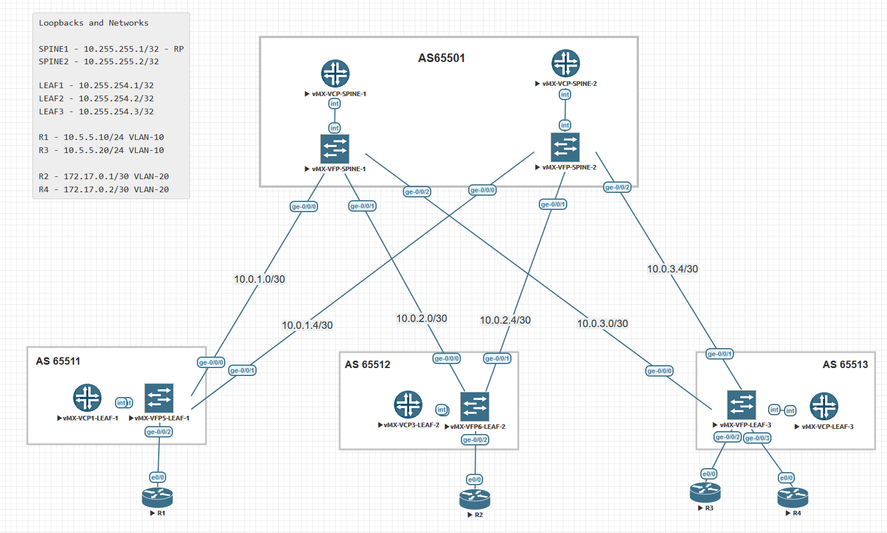

# Лабораторная работа по теме "VxLAN Multicast - OSPF"

### Цель:
- исследовать построение VxLAN с распространением BUM трафика по Multicast.

### Топология



## Реализация

Underlay маршрутизации на основе OSPF.
Добавлена конфигурация bridge-domain, конфигурация VLAN, VxLAN и PIM. 


Пример конфигурации VxLAN Multicast для Leaf-1
```
set chassis fpc 0 pic 0 tunnel-services bandwidth 1g

set interfaces ge-0/0/2 vlan-tagging
set interfaces ge-0/0/2 encapsulation flexible-ethernet-services
set interfaces ge-0/0/2 unit 0 encapsulation vlan-bridge
set interfaces ge-0/0/2 unit 0 vlan-id 10

set protocols pim rp static address 10.255.255.1
set protocols pim interface ge-0/0/0.0 mode bidirectional-sparse
set protocols pim interface ge-0/0/1.0 mode bidirectional-sparse
set protocols pim interface lo0.0 mode bidirectional-sparse

set bridge-domains VLAN_10 vlan-id 10
set bridge-domains VLAN_10 interface ge-0/0/2.0
set bridge-domains VLAN_10 vxlan vni 10010
set bridge-domains VLAN_10 vxlan multicast-group 225.0.0.10

set switch-options vtep-source-interface lo0.0
```
Ключевые моменты
`set chassis fpc 0 pic 0 tunnel-services bandwidth 1g` включает tunnel сервис на vMX. 
Без этой фичи не будет работать multicast. 


На Spine-1 нужно сконфигурировать только PIM и нахначить его как RP.
```
set protocols pim rp local address 10.255.255.1
set protocols pim interface ge-0/0/0.0 mode bidirectional-sparse
set protocols pim interface ge-0/0/1.0 mode bidirectional-sparse
set protocols pim interface ge-0/0/2.0 mode bidirectional-sparse
set protocols pim interface lo0.0 mode bidirectional-sparse
```

Пример вывода PIM соседств с leaf-3
```
root@leaf-3> show pim neighbors
B = Bidirectional Capable, G = Generation Identifier
H = Hello Option Holdtime, L = Hello Option LAN Prune Delay,
P = Hello Option DR Priority, T = Tracking Bit,
A = Hello Option Join Attribute

Instance: PIM.master
Interface           IP V Mode        Option       Uptime Neighbor addr
ge-0/0/0.0           4 2             HPLGBTA     01:38:07 10.0.3.2
ge-0/0/1.0           4 2             HPLGBTA     01:12:32 10.0.3.6
```

Пример вывода PIM соседств со spine-1
```
root@spine-1> show pim neighbors
B = Bidirectional Capable, G = Generation Identifier
H = Hello Option Holdtime, L = Hello Option LAN Prune Delay,
P = Hello Option DR Priority, T = Tracking Bit,
A = Hello Option Join Attribute

Instance: PIM.master
Interface           IP V Mode        Option       Uptime Neighbor addr
ge-0/0/0.0           4 2             HPLGBTA     01:42:55 10.0.1.1
ge-0/0/1.0           4 2             HPLGBTA     00:30:34 10.0.2.1
ge-0/0/2.0           4 2             HPLGBTA     01:38:33 10.0.3.1
```

PIM Join на spine-1
```
root@spine-1> show pim join
Instance: PIM.master Family: INET
R = Rendezvous Point Tree, S = Sparse, W = Wildcard

Group: 225.0.0.10
    Source: *
    RP: 10.255.255.1
    Flags: sparse,rptree,wildcard
    Upstream interface: Local

Group: 225.0.0.10
    Source: 10.255.254.1
    Flags: sparse
    Upstream interface: ge-0/0/0.0

Group: 225.0.0.10
    Source: 10.255.254.3
    Flags: sparse
    Upstream interface: ge-0/0/2.0

Group: 236.0.0.20
    Source: *
    RP: 10.255.255.1
    Flags: sparse,rptree,wildcard
    Upstream interface: Local

Group: 236.0.0.20
    Source: 10.255.254.2
    Flags: sparse
    Upstream interface: ge-0/0/1.0

Group: 236.0.0.20
    Source: 10.255.254.3
    Flags: sparse
    Upstream interface: ge-0/0/2.0

Instance: PIM.master Family: INET6
R = Rendezvous Point Tree, S = Sparse, W = Wildcard
```

Доступность R1->R3
```
R1#show ip int br
Interface                  IP-Address      OK? Method Status                Protocol
Ethernet0/0                unassigned      YES unset  up                    up
Ethernet0/0.10             10.5.5.10       YES manual up                    up
Ethernet0/1                unassigned      YES unset  administratively down down
Ethernet0/2                unassigned      YES unset  administratively down down
Ethernet0/3                unassigned      YES unset  administratively down down
R1#ping 10.5.5.20
Type escape sequence to abort.
Sending 5, 100-byte ICMP Echos to 10.5.5.20, timeout is 2 seconds:
!!!!!
Success rate is 100 percent (5/5), round-trip min/avg/max = 4/5/8 ms
R1#

```
Доступность R3->R1
```
R3#show ip int br
Interface                  IP-Address      OK? Method Status                Protocol
Ethernet0/0                unassigned      YES unset  up                    up
Ethernet0/0.10             10.5.5.20       YES manual up                    up
Ethernet0/1                unassigned      YES unset  administratively down down
Ethernet0/2                unassigned      YES unset  administratively down down
Ethernet0/3                unassigned      YES unset  administratively down down
R3#ping 10.5.5.10
Type escape sequence to abort.
Sending 5, 100-byte ICMP Echos to 10.5.5.10, timeout is 2 seconds:
!!!!!
Success rate is 100 percent (5/5), round-trip min/avg/max = 4/5/7 ms
R3#
```

Доступность R2->R4
```
R2#show ip int br
Interface                  IP-Address      OK? Method Status                Protocol
Ethernet0/0                unassigned      YES unset  up                    up
Ethernet0/0.20             172.17.0.1      YES manual up                    up
Ethernet0/1                unassigned      YES unset  administratively down down
Ethernet0/2                unassigned      YES unset  administratively down down
Ethernet0/3                unassigned      YES unset  administratively down down
R2#ping 172.17.0.2
Type escape sequence to abort.
Sending 5, 100-byte ICMP Echos to 172.17.0.2, timeout is 2 seconds:
.!!!!
Success rate is 80 percent (4/5), round-trip min/avg/max = 4/5/10 ms
```

Доступность R4->R2
```
R4#show ip int br
Interface                  IP-Address      OK? Method Status                Protocol
Ethernet0/0                unassigned      YES unset  up                    up
Ethernet0/0.20             172.17.0.2      YES manual up                    up
Ethernet0/1                unassigned      YES unset  administratively down down
Ethernet0/2                unassigned      YES unset  administratively down down
Ethernet0/3                unassigned      YES unset  administratively down down
R4#ping 172.17.0.1
Type escape sequence to abort.
Sending 5, 100-byte ICMP Echos to 172.17.0.1, timeout is 2 seconds:
!!!!!
Success rate is 100 percent (5/5), round-trip min/avg/max = 5/6/8 ms
R4#
```


### Дополнительные выводы с leaf-3

Как видно JunOS создал отдельные vtep саб-интерфейсы для каждого соседа - это 32768, 32769, 32770.

```
root@leaf-3> show interfaces vtep
Physical interface: vtep, Enabled, Physical link is Up
  Interface index: 134, SNMP ifIndex: 508
  Type: Software-Pseudo, Link-level type: VxLAN-Tunnel-Endpoint, MTU: Unlimited,
  Speed: Unlimited
  Device flags   : Present Running
  Link type      : Full-Duplex
  Link flags     : None
  Last flapped   : Never
    Input packets : 0
    Output packets: 0

  Logical interface vtep.32768 (Index 327) (SNMP ifIndex 549)
    Flags: Up SNMP-Traps 0x4000 Encapsulation: ENET2
    Ethernet segment value: 00:00:00:00:00:00:00:00:00:00, Mode: single-homed,
    Multi-homed status: Forwarding
    VXLAN Endpoint Type: Source, VXLAN Endpoint Address: 10.255.254.3, L2 Routing Instance: default-switch, L3 Routing Instance: default
    Input packets : 0
    Output packets: 0

  Logical interface vtep.32769 (Index 347) (SNMP ifIndex 547)
    Flags: Up SNMP-Traps Encapsulation: ENET2
    VXLAN Endpoint Type: Remote, VXLAN Endpoint Address: 10.255.254.1, L2 Routing Instance: default-switch, L3 Routing Instance: default
    Input packets : 16
    Output packets: 16
    Protocol bridge, MTU: Unlimited
      Flags: Trunk-Mode

  Logical interface vtep.32770 (Index 348) (SNMP ifIndex 562)
    Flags: Up SNMP-Traps Encapsulation: ENET2
    VXLAN Endpoint Type: Remote, VXLAN Endpoint Address: 10.255.254.2, L2 Routing Instance: default-switch, L3 Routing Instance: default
    Input packets : 14
    Output packets: 14
    Protocol bridge, MTU: Unlimited
      Flags: Trunk-Mode

root@leaf-3>
```

Вывод MAC таблицы для bridge-domain.
```
root@leaf-3> show bridge mac-table bridge-domain VLAN_10

MAC flags       (S -static MAC, D -dynamic MAC, L -locally learned, C -Control MAC
    O -OVSDB MAC, SE -Statistics enabled, NM -Non configured MAC, R -Remote PE MAC, P -Pinned MAC)

Routing instance : default-switch
 Bridging domain : VLAN_10, VLAN : 10
   MAC                 MAC      Logical          NH     MAC         active
   address             flags    interface        Index  property    source
   aa:bb:cc:00:0b:00   D        vtep.32769
   aa:bb:cc:00:0c:00   D        ge-0/0/2.0

root@leaf-3> show bridge mac-table bridge-domain VLAN_20

MAC flags       (S -static MAC, D -dynamic MAC, L -locally learned, C -Control MAC
    O -OVSDB MAC, SE -Statistics enabled, NM -Non configured MAC, R -Remote PE MAC, P -Pinned MAC)

Routing instance : default-switch
 Bridging domain : VLAN_20, VLAN : 20
   MAC                 MAC      Logical          NH     MAC         active
   address             flags    interface        Index  property    source
   aa:bb:cc:00:02:00   D        ge-0/0/3.0
   aa:bb:cc:00:04:00   D        vtep.32770

root@leaf-3>
```

```
root@leaf-3> show bridge statistics bridge-domain VLAN_10
Bridge domain: null/default-switch/VLAN_10:10
   Local interface: ge-0/0/2.0, Index: 337
     Broadcast packets:                     0
     Broadcast bytes  :                     0
     Multicast packets:                     0
     Multicast bytes  :                     0
     Flooded packets  :                     0
     Flooded bytes    :                     0
     Unicast packets  :                     0
     Unicast bytes    :                     0
     Current MAC count:                     1 (Limit 1024)
   Local interface: vtep.32769, Index: 347
     Broadcast packets:                     0
     Broadcast bytes  :                     0
     Multicast packets:                     0
     Multicast bytes  :                     0
     Flooded packets  :                     0
     Flooded bytes    :                     0
     Unicast packets  :                     0
     Unicast bytes    :                     0
     Current MAC count:                     1

```

Почистив arp и mac таблицы на leaf и R1,3 роутерах, сделал пинг.
```
root@leaf-3> show bridge statistics bridge-domain VLAN_10
Bridge domain: null/default-switch/VLAN_10:10
   Local interface: ge-0/0/2.0, Index: 337
     Broadcast packets:                     4
     Broadcast bytes  :                   256
     Multicast packets:                     0
     Multicast bytes  :                     0
     Flooded packets  :                     1
     Flooded bytes    :                    64
     Unicast packets  :                     8
     Unicast bytes    :                   782
     Current MAC count:                     1 (Limit 1024)
   Local interface: vtep.32769, Index: 347
     Broadcast packets:                     1
     Broadcast bytes  :                    60
     Multicast packets:                     0
     Multicast bytes  :                     0
     Flooded packets  :                     0
     Flooded bytes    :                     0
     Unicast packets  :                     8
     Unicast bytes    :                   750
     Current MAC count:                     1

root@leaf-3>
```