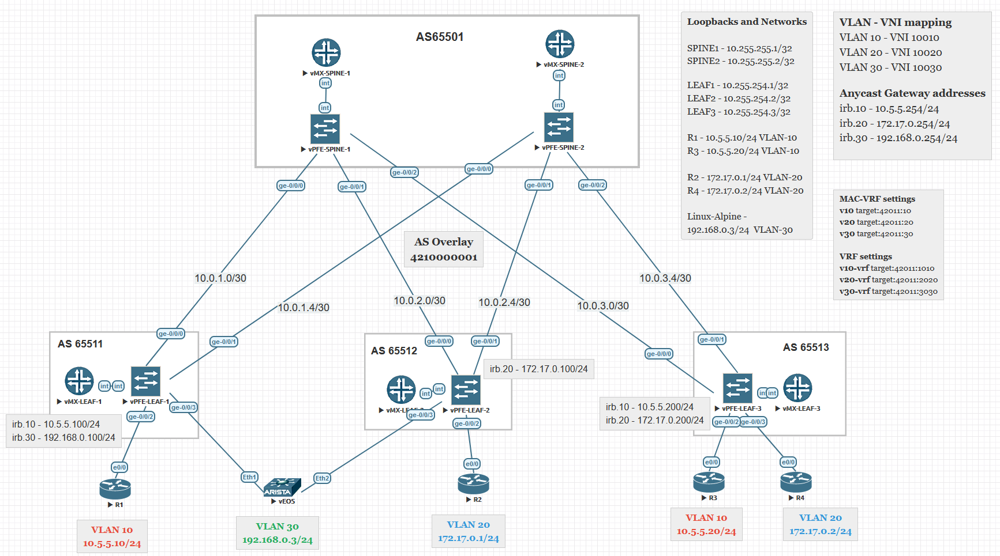

# Лабораторная работа по теме "ESI LAG"

### Цель:
- Рассмотреть возможности подключения multihoming клиентов.


### Топология



## Реализация

Underlay маршрутизации на основе eBGP.  
Overlay на основе iBGP все spine и leaf в одной AS 4210000001.  
  
vEOS выполняет роль MultiHome клиента который одновременно включен в Leaf-1 и Leaf-2.  
На vEOS оба порта объединины в LAG с LACP active.  
На Leaf-1, Leaf-2 собираем aggregate interface с одним физическим портом и указываем одинаковый system-id.

Пример конфигурации для Leaf-1
```
set chassis aggregated-devices ethernet device-count 4 
set interfaces ge-0/0/3 gigether-options 802.3ad ae0
set interfaces ae1 flexible-vlan-tagging             
set interfaces ae1 mtu 9216  
set interfaces ae1 encapsulation extended-vlan-bridge
set interfaces ae1 esi 00:aa:bb:cc:11:22:33:44:55:66 
set interfaces ae1 esi all-active 
set interfaces ae1 aggregated-ether-options lacp active   
set interfaces ae1 aggregated-ether-options lacp system-id 11:22:33:44:55:66 
set interfaces ae1 unit 30 vlan-id 30                

```
`all-active` - говорит о том, что оба пира будут работать в режиме Active-Active

Далее добавляем интерфейс ae1 в routing-instance v30.
Аналогичная конфигурация для Leaf-2, но нужно добавить и сам `mac-vrf` и `vrf`.

## Связность

Доступность с vEOS до всех других клиентов сохраняется.
```
Server-MH#ping 10.5.5.10 repeat 1
PING 10.5.5.10 (10.5.5.10) 72(100) bytes of data.
80 bytes from 10.5.5.10: icmp_seq=1 ttl=254 time=14.9 ms

--- 10.5.5.10 ping statistics ---
1 packets transmitted, 1 received, 0% packet loss, time 0ms
rtt min/avg/max/mdev = 14.920/14.920/14.920/0.000 ms
Server-MH#ping 10.5.5.20 repeat 1
PING 10.5.5.20 (10.5.5.20) 72(100) bytes of data.
80 bytes from 10.5.5.20: icmp_seq=1 ttl=253 time=17.8 ms

--- 10.5.5.20 ping statistics ---
1 packets transmitted, 1 received, 0% packet loss, time 0ms
rtt min/avg/max/mdev = 17.897/17.897/17.897/0.000 ms
Server-MH#ping 172.17.0.1 repeat 1
PING 172.17.0.1 (172.17.0.1) 72(100) bytes of data.
80 bytes from 172.17.0.1: icmp_seq=1 ttl=253 time=22.8 ms

--- 172.17.0.1 ping statistics ---
1 packets transmitted, 1 received, 0% packet loss, time 0ms
rtt min/avg/max/mdev = 22.819/22.819/22.819/0.000 ms
Server-MH#ping 172.17.0.2 repeat 1
PING 172.17.0.2 (172.17.0.2) 72(100) bytes of data.
80 bytes from 172.17.0.2: icmp_seq=1 ttl=253 time=16.5 ms

--- 172.17.0.2 ping statistics ---
1 packets transmitted, 1 received, 0% packet loss, time 0ms
rtt min/avg/max/mdev = 16.578/16.578/16.578/0.000 ms
Server-MH#
```

# Таблица маршрутизации устройств

### leaf-3
```
root@leaf-3> show mac-vrf routing instance v10 esi 00:aa:bb:cc:11:22:33:44:55:66 esi-info
Instance: v10            
  Number of ethernet segments: 4                 
    ESI: 00:aa:bb:cc:11:22:33:44:55:66           
      Status: Resolved   
      Number of remote PEs connected: 2          
        Remote-PE        MAC-label  Aliasing-label  Mode                 
        10.255.254.2     10030      10030           all-active           
        10.255.254.1     10030      10030           all-active           
 
```

Детальный вывод маршрута c leaf-1.
```
root@leaf-1> show route evpn-mac-address 50:00:00:ae:f7:03 detail table v30  
     
v30-vrf.inet.0: 15 destinations, 30 routes (15 active, 0 holddown, 0 hidden) 
     
v30-vrf.inet6.0: 1 destinations, 1 routes (1 active, 0 holddown, 0 hidden)   
     
v30.evpn.0: 42 destinations, 76 routes (42 active, 0 holddown, 0 hidden)     
2:10.255.254.1:3::0::50:00:00:ae:f7:03/304 MAC/IP (1 entry, 1 announced)     
        *EVPN   Preference: 170   
                Next hop type: Indirect, Next hop index: 0
                Address: 0x89fcc50
                Next-hop reference count: 41, key opaque handle: 0x0         
                Protocol next hop: 10.255.254.1      
                Indirect next hop: 0x0 - INH Session ID: 0
                State: <Active Int Ext>              
                Age: 19:39   
                Validation State: unverified         
                Task: v30-evpn    
                Announcement bits (1): 2-rt-export   
                AS path: I   
                Communities: encapsulation:vxlan(0x8)
                Route Label: 10030
                ESI: 00:aa:bb:cc:11:22:33:44:55:66   
                Thread: junos-main
2:10.255.254.2:3::0::50:00:00:ae:f7:03/304 MAC/IP (2 entries, 1 announced)
        *BGP    Preference: 170/-101              
                Route Distinguisher: 10.255.254.2:3    
                Next hop type: Indirect, Next hop index: 0                
                Address: 0x89fdb14                
                Next-hop reference count: 112, key opaque handle: 0x0     
                Source: 10.255.255.1              
                Protocol next hop: 10.255.254.2   
                Indirect next hop: 0x2 no-forward INH Session ID: 0       
                State: <Secondary Active Int Ext> 
                Local AS: 4210000001 Peer AS: 4210000001                  
                Age: 19:49      Metric2: 0        
                Validation State: unverified      
                Task: BGP_4210000001.10.255.255.1 
                Announcement bits (1): 0-v30-evpn 
                AS path: I  (Originator)          
                Cluster list:  10.255.250.1       
                Originator ID: 10.255.254.2       
                Communities: target:42011:30 encapsulation:vxlan(0x8)     
                Import Accepted
                Route Label: 10030                
                ESI: 00:aa:bb:cc:11:22:33:44:55:66
                Localpref: 100 
                Router ID: 10.255.255.1           
                Primary Routing Table: bgp.evpn.0 
                Thread: junos-main                
         BGP    Preference: 170/-101              
                Route Distinguisher: 10.255.254.2:3    
                Next hop type: Indirect, Next hop index: 0                
                Address: 0x89fdb14                
                Next-hop reference count: 112, key opaque handle: 0x0     
                Source: 10.255.255.2              
                Protocol next hop: 10.255.254.2   
                Indirect next hop: 0x2 no-forward INH Session ID: 0       
                State: <Secondary NotBest Int Ext Changed>                
                Inactive reason: Not Best in its group - Update source    
                Local AS: 4210000001 Peer AS: 4210000001                  
                Age: 4:19       Metric2: 0        
                Validation State: unverified      
                Task: BGP_4210000001.10.255.255.2 
                AS path: I  (Originator)          
                Cluster list:  10.255.250.1       
                Originator ID: 10.255.254.2       
                Communities: target:42011:30 encapsulation:vxlan(0x8)     
                Import Accepted
                Route Label: 10030                
                ESI: 00:aa:bb:cc:11:22:33:44:55:66
                Localpref: 100 
                Router ID: 10.255.255.2           
                Primary Routing Table: bgp.evpn.0 
                Thread: junos-main                
2:10.255.254.1:3::0::50:00:00:ae:f7:03::192.168.0.3/304 MAC/IP (1 entry, 1 announced)               
        *EVPN   Preference: 170  
                Next hop type: Indirect, Next hop index: 0                  
                Address: 0x89fcc50                  
                Next-hop reference count: 41, key opaque handle: 0x0        
                Protocol next hop: 10.255.254.1     
                Indirect next hop: 0x0 - INH Session ID: 0                  
                State: <Active Int Ext>             
                Age: 19:33  
                Validation State: unverified        
                Task: v30-evpn   
                Announcement bits (1): 2-rt-export  
                AS path: I  
                Communities: target:42011:3030 encapsulation:vxlan(0x8) router-mac:2c:6b:f5:18:6f:f0
                Route Label: 10030                  
                Route Label: 9930
                ESI: 00:aa:bb:cc:11:22:33:44:55:66  
                Thread: junos-main                  
2:10.255.254.2:3::0::50:00:00:ae:f7:03::192.168.0.3/304 MAC/IP (2 entries, 1 announced)     
        *BGP    Preference: 170/-101        
                Route Distinguisher: 10.255.254.2:3                 
                Next hop type: Indirect, Next hop index: 0          
                Address: 0x89fdb14          
                Next-hop reference count: 112, key opaque handle: 0x0    
                Source: 10.255.255.1        
                Protocol next hop: 10.255.254.2  
                Indirect next hop: 0x2 no-forward INH Session ID: 0 
                State: <Secondary Active Int Ext>
                Local AS: 4210000001 Peer AS: 4210000001            
                Age: 19:49      Metric2: 0  
                Validation State: unverified
                Task: BGP_4210000001.10.255.255.1
                Announcement bits (1): 0-v30-evpn
                AS path: I  (Originator)    
                Cluster list:  10.255.250.1 
                Originator ID: 10.255.254.2 
                Communities: target:42011:30 target:42011:3030 encapsulation:vxlan(0x8) router-mac:2c:6b:f5:6d:31:f0
                Import Accepted
                Route Label: 10030          
                Route Label: 9930           
                ESI: 00:aa:bb:cc:11:22:33:44:55:66                  
                Localpref: 100 
                Router ID: 10.255.255.1     
                Primary Routing Table: bgp.evpn.0
                Thread: junos-main          
         BGP    Preference: 170/-101        
                Route Distinguisher: 10.255.254.2:3                 
                Next hop type: Indirect, Next hop index: 0          
                Address: 0x89fdb14          
                Next-hop reference count: 112, key opaque handle: 0x0    
                Source: 10.255.255.2        
                Protocol next hop: 10.255.254.2  
                Indirect next hop: 0x2 no-forward INH Session ID: 0 
                State: <Secondary NotBest Int Ext Changed>          
                Inactive reason: Not Best in its group - Update source   
                Local AS: 4210000001 Peer AS: 4210000001            
                Age: 4:19       Metric2: 0  
                Validation State: unverified
                Task: BGP_4210000001.10.255.255.2
                AS path: I  (Originator)    
                Cluster list:  10.255.250.1 
                Originator ID: 10.255.254.2 
                Communities: target:42011:30 target:42011:3030 encapsulation:vxlan(0x8) router-mac:2c:6b:f5:6d:31:f0
                Import Accepted
                Route Label: 10030          
                Route Label: 9930           
                ESI: 00:aa:bb:cc:11:22:33:44:55:66                  
                Localpref: 100 
                Router ID: 10.255.255.2     
                Primary Routing Table: bgp.evpn.0
                Thread: junos-main
```

### Детальное описание ESI с каждого пира

Leaf-1
```
root@leaf-1> show evpn instance v30 extensive                                                    
Instance: v30                                                                                    
  Route Distinguisher: 10.255.254.1:3                                                            
  VLAN ID: 30                                                                                    
  Encapsulation type: VXLAN                                                                      
  Control word enabled                                                                           
  Duplicate MAC detection threshold: 5                                                           
  Duplicate MAC detection window: 180                                                            
  MAC database status                     Local  Remote                                          
    MAC advertisements:                       2      12                                          
    MAC+IP advertisements:                    3      11                                          
    Default gateway MAC advertisements:       2       4                                          
  Number of local interfaces: 2 (2 up)                                                           
    Interface name  ESI                            Mode             Status     AC-Role           
    .local..15      00:00:00:00:00:00:00:00:00:00  single-homed     Up         Root              
    ae1.30          00:aa:bb:cc:11:22:33:44:55:66  all-active       Up         Root              
  Number of IRB interfaces: 1 (1 up)                                                             
    Interface name  VLAN   VNI    Status  L3 context                                             
    irb.30                 10030   Up     v30-vrf                                                
  Number of protect interfaces: 0                                                                
  Number of bridge domains: 1                                                                    
    VLAN  Domain-ID Intfs/up   IRB-intf  Mode            MAC-sync v4-SG-sync v6-SG-sync          
    30    10030        1  1    irb.30    Extended        Enabled  Disabled   Disabled            
  Number of neighbors: 2                                                                         
    Address               MAC    MAC+IP        AD        IM        ES Leaf-label Remote-DCI-Peer 
    10.255.254.2            6         6         4         2         0                            
    10.255.254.3            6         6         2         2         0                            
  Number of ethernet segments: 4                                                                 
    ESI: 00:aa:bb:cc:11:22:33:44:55:66                                                           
      Status: Resolved by IFL ae1.30                                                             
      Local interface: ae1.30, Status: Up/Forwarding                                             
      Number of remote PEs connected: 1                                                          
        Remote-PE        MAC-label  Aliasing-label  Mode                                         
        10.255.254.2     10030      10030           all-active                                   
      DF Election Algorithm: MOD based                                                           
      Designated forwarder: 10.255.254.1                                                         
      Backup forwarder: 10.255.254.2                                                             
      Last designated forwarder update: Oct 19 12:19:40                                          
    ESI: 05:fa:ef:80:81:00:00:27:1a:00                                                           
      Status: Resolved                                                                           
      Number of remote PEs connected: 1                                                          
        Remote-PE        MAC-label  Aliasing-label  Mode                                         
        10.255.254.3     10010      0               all-active                                   
    ESI: 05:fa:ef:80:81:00:00:27:24:00                                                           
      Status: Resolved                                                                           
      Number of remote PEs connected: 2                                                          
        Remote-PE        MAC-label  Aliasing-label  Mode                                         
        10.255.254.2     10020      0               all-active                                   
        10.255.254.3     10020      0               all-active                                   
    ESI: 05:fa:ef:80:81:00:00:27:2e:00                                                           
      Local interface: irb.30, Status: Up/Forwarding                                             
      Number of remote PEs connected: 1                                                          
        Remote-PE        MAC-label  Aliasing-label  Mode                                         
        10.255.254.2     10030      0               all-active                                   
  Router-ID: 10.255.254.1                                                                        
  Source VTEP interface IP: 10.255.254.1                                                         
  SMET Forwarding: Disabled                                                                      
```

Leaf-2
```
root@leaf-2> show evpn instance v30 extensive
Instance: v30
  Route Distinguisher: 10.255.254.2:3
  VLAN ID: 30
  Encapsulation type: VXLAN
  Control word enabled
  Duplicate MAC detection threshold: 5
  Duplicate MAC detection window: 180
  MAC database status                     Local  Remote
    MAC advertisements:                       2      12
    MAC+IP advertisements:                    3      11
    Default gateway MAC advertisements:       2       4
  Number of local interfaces: 2 (2 up)
    Interface name  ESI                            Mode             Status     AC-Role
    .local..11      00:00:00:00:00:00:00:00:00:00  single-homed     Up         Root
    ae1.30          00:aa:bb:cc:11:22:33:44:55:66  all-active       Up         Root
  Number of IRB interfaces: 1 (1 up)
    Interface name  VLAN   VNI    Status  L3 context
    irb.30                 10030   Up     v30-vrf
  Number of protect interfaces: 0
  Number of bridge domains: 1
    VLAN  Domain-ID Intfs/up   IRB-intf  Mode            MAC-sync v4-SG-sync v6-SG-sync
    30    10030        1  1    irb.30    Extended        Enabled  Disabled   Disabled
  Number of neighbors: 2
    Address               MAC    MAC+IP        AD        IM        ES Leaf-label Remote-DCI-Peer
    10.255.254.1            6         6         4         2         0
    10.255.254.3            6         6         2         2         0
  Number of ethernet segments: 4
    ESI: 00:aa:bb:cc:11:22:33:44:55:66
      Status: Resolved by IFL ae1.30
      Local interface: ae1.30, Status: Up/Forwarding
      Number of remote PEs connected: 1
        Remote-PE        MAC-label  Aliasing-label  Mode
        10.255.254.1     10030      10030           all-active
      DF Election Algorithm: MOD based
      Designated forwarder: 10.255.254.1
      Backup forwarder: 10.255.254.2
      Last designated forwarder update: Oct 19 12:19:46
    ESI: 05:fa:ef:80:81:00:00:27:1a:00
      Status: Resolved
      Number of remote PEs connected: 2
        Remote-PE        MAC-label  Aliasing-label  Mode
        10.255.254.3     10010      0               all-active
        10.255.254.1     10010      0               all-active
    ESI: 05:fa:ef:80:81:00:00:27:24:00
      Status: Resolved
      Number of remote PEs connected: 1
        Remote-PE        MAC-label  Aliasing-label  Mode
        10.255.254.3     10020      0               all-active
    ESI: 05:fa:ef:80:81:00:00:27:2e:00
      Local interface: irb.30, Status: Up/Forwarding
      Number of remote PEs connected: 1
        Remote-PE        MAC-label  Aliasing-label  Mode
        10.255.254.1     10030      0               all-active
  Router-ID: 10.255.254.2
  Source VTEP interface IP: 10.255.254.2
  SMET Forwarding: Disabled

```

Useful links
[EVPN Multihoming Overview](https://www.juniper.net/documentation/us/en/software/junos/evpn-vxlan/topics/concept/evpn-bgp-multihoming-overview.html)  
[Isolation node tracking](https://www.juniper.net/documentation/us/en/software/junos/evpn-vxlan/topics/concept/evpn-core-isolation-interface-shutdown-service-tracking.html)  
[Cases of Isolation](https://www.juniper.net/documentation/us/en/software/junos/evpn-vxlan/topics/concept/evpn-vxlan-core-isolation-disabling.html)  
[Multihoming an Ethernet-Connected End System Design and Implementation](https://www.juniper.net/documentation/us/en/software/nce/sg-005-data-center-fabric/topics/task/l2-multihoming-cloud-dc-configuring.html)  
[Data Center Fabric Blueprint Architecture Components](https://www.juniper.net/documentation/us/en/software/nce/sg-005-data-center-fabric/topics/concept/solution-cloud-data-center-components.html#data-center-fabric-blueprint-architecture-components__multihoming-l2-overview)  
[RFC-8365](https://www.rfc-editor.org/rfc/rfc8365.html#section-8.1)