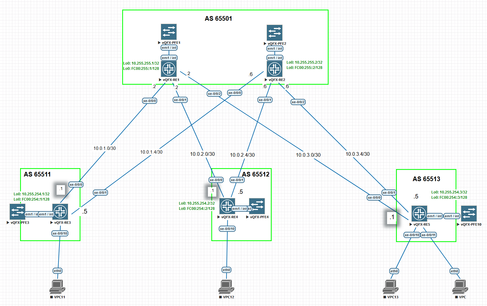

# Лабораторная работа по теме "Построение Underlay сети(eBGP)"

### Цель:
- исследовать построение Underlay сети с использованием eBGP

### Топология



## Реализация

В конфигурацию устройств был добавлен BGP протокол.


Пример конфигурации BGP для Leaf-1
```
set protocols bgp group UNDERLAY type external
set protocols bgp group UNDERLAY local-as 65511
set protocols bgp group UNDERLAY peer-as 65501
set protocols bgp group UNDERLAY neighbor 10.0.1.2
set protocols bgp group UNDERLAY neighbor 10.0.1.6
set protocols bgp group UNDERLAY hold-time 10
set protocols bgp group UNDERLAY family inet unicast
set protocols bgp group UNDERLAY multipath multiple-as

set policy-options policy-statement BGP_LOOPBACK0 term TERM1 from protocol direct
set policy-options policy-statement BGP_LOOPBACK0 term TERM1 from route-filter 0.0.0.0/0 prefix-length-range /32-/32
set policy-options policy-statement BGP_LOOPBACK0 term TERM1 then accept
set protocols bgp group UNDERLAY export BGP_LOOPBACK0

set policy-options policy-statement PFE-ECMP then load-balance per-packet
set routing-options forwarding-table export PFE-ECMP
```

Пример конфигурации BGP для Spine-1
```
set protocols bgp group UNDERLAY type external
set protocols bgp group UNDERLAY local-as 65501
set protocols bgp group UNDERLAY neighbor 10.0.1.1 peer-as 65511
set protocols bgp group UNDERLAY neighbor 10.0.2.1 peer-as 65512
set protocols bgp group UNDERLAY neighbor 10.0.3.1 peer-as 65513
set protocols bgp group UNDERLAY hold-time 10
set protocols bgp group UNDERLAY family inet unicast
set protocols bgp group UNDERLAY multipath multiple-as

set policy-options policy-statement PFE-ECMP then load-balance per-packet
set routing-options forwarding-table export PFE-ECMP
```

Пример вывода BGP соседств с leaf-3
```
root@leaf-3> show bgp summary 
Groups: 1 Peers: 2 Down peers: 0
Table          Tot Paths  Act Paths Suppressed    History Damp State    Pending
inet.0
                       4          4          0          0          0          0
Peer                     AS      InPkt     OutPkt    OutQ   Flaps Last Up/Dwn State|#Active/Received/Accepted/Damped...
10.0.3.2              65501        181        177       0       0        8:55 2/2/2/0              0/0/0/0
10.0.3.6              65501         19         17       0       0          44 2/2/2/0              0/0/0/0
```

Пример вывода BGP соседств со spine-1
```
root@spine-1> show bgp summary 
Groups: 1 Peers: 3 Down peers: 0
Table          Tot Paths  Act Paths Suppressed    History Damp State    Pending
inet.0
                       3          3          0          0          0          0
Peer                     AS      InPkt     OutPkt    OutQ   Flaps Last Up/Dwn State|#Active/Received/Accepted/Damped...
10.0.1.1              65511        294        262       0       0       13:07 1/1/1/0              0/0/0/0
10.0.2.1              65512        163        165       0       0        8:13 1/1/1/0              0/0/0/0
10.0.3.1              65513        181        183       0       0        9:08 1/1/1/0              0/0/0/0
```

Таблица маршрутизации протокола BGP
```
{master:0}
root@leaf-3> show route protocol bgp    
inet.0: 9 destinations, 11 routes (9 active, 0 holddown, 0 hidden)
+ = Active Route, - = Last Active, * = Both

10.255.254.1/32    *[BGP/170] 00:01:11, localpref 100, from 10.0.3.2
                      AS path: 65501 65511 I, validation-state: unverified
                      to 10.0.3.2 via xe-0/0/0.0
                    > to 10.0.3.6 via xe-0/0/1.0
                    [BGP/170] 00:01:11, localpref 100
                      AS path: 65501 65511 I, validation-state: unverified
                    > to 10.0.3.6 via xe-0/0/1.0
10.255.254.2/32    *[BGP/170] 00:01:12, localpref 100, from 10.0.3.2
                      AS path: 65501 65512 I, validation-state: unverified
                      to 10.0.3.2 via xe-0/0/0.0
                    > to 10.0.3.6 via xe-0/0/1.0
                    [BGP/170] 00:01:12, localpref 100
                      AS path: 65501 65512 I, validation-state: unverified
                    > to 10.0.3.6 via xe-0/0/1.0
```

Доступность Leaf-1, Leaf-2, Spine-1, Spine-2 с Leaf-3
```
{master:0}
root@leaf-3> ping 10.255.254.1 source 10.255.254.3 count 1
PING 10.255.254.1 (10.255.254.1): 56 data bytes
64 bytes from 10.255.254.1: icmp_seq=0 ttl=63 time=296.561 ms

--- 10.255.254.1 ping statistics ---
1 packets transmitted, 1 packets received, 0% packet loss
round-trip min/avg/max/stddev = 296.561/296.561/296.561/0.000 ms

{master:0}
root@leaf-3> ping 10.255.254.2 source 10.255.254.3 count 1
PING 10.255.254.2 (10.255.254.2): 56 data bytes
64 bytes from 10.255.254.2: icmp_seq=0 ttl=63 time=311.989 ms

--- 10.255.254.2 ping statistics ---
1 packets transmitted, 1 packets received, 0% packet loss
round-trip min/avg/max/stddev = 311.989/311.989/311.989/0.000 ms
```

Multipath работает
```
{master:0}
root@leaf-3> show route 10.255.254.1 detail 

inet.0: 9 destinations, 11 routes (9 active, 0 holddown, 0 hidden)
10.255.254.1/32 (2 entries, 1 announced)
        *BGP    Preference: 170/-101
                Next hop type: Router, Next hop index: 0
                Address: 0xb21bb10
                Next-hop reference count: 3
                Source: 10.0.3.2
                Next hop: 10.0.3.2 via xe-0/0/0.0
                Session Id: 0x0
                Next hop: 10.0.3.6 via xe-0/0/1.0, selected
                Session Id: 0x0
                State: <Active Ext>
                Peer AS: 65501
                Age: 2:18
                Validation State: unverified
                Task: BGP_65501_65513.10.0.3.2
                Announcement bits (2): 0-KRT 1-BGP_Listen.0.0.0.0+179
                AS path: 65501 65511 I
                Accepted Multipath
                Localpref: 100
                Router ID: 10.255.255.1
         BGP    Preference: 170/-101
                Next hop type: Router, Next hop index: 1740
                Address: 0xb3a1630
                Next-hop reference count: 3
                Source: 10.0.3.6
                Next hop: 10.0.3.6 via xe-0/0/1.0, selected
                Session Id: 0x0
                State: <NotBest Ext>
                Inactive reason: Not Best in its group - Active preferred
                Peer AS: 65501
                Age: 2:18
                Validation State: unverified
                Task: BGP_65501_65513.10.0.3.6
                AS path: 65501 65511 I
                Accepted MultipathContrib
                Localpref: 100
                Router ID: 10.255.255.2
```
И fib
```
root@leaf-3> show route forwarding-table destination 10.255.254.1 
Routing table: default.inet
Internet:
Enabled protocols: Bridging,
Destination        Type RtRef Next hop           Type Index    NhRef Netif
10.255.254.1/32    user     0                    ulst   131070     3
                              10.0.3.2           ucst     1739     4 xe-0/0/0.0
                              10.0.3.6           ucst     1740     5 xe-0/0/1.0
```

[JunOS BGP multipath](https://www.juniper.net/documentation/us/en/software/junos/bgp/topics/topic-map/load-balancing-bgp-session.html)

[IP Fabric Underlay Network Design and Implementation](https://www.juniper.net/documentation/us/en/software/nce/sg-005-data-center-fabric/topics/task/ip-fabric-underlay-cloud-dc-configuring.html)

[RFC-7938](https://datatracker.ietf.org/doc/html/rfc7938)